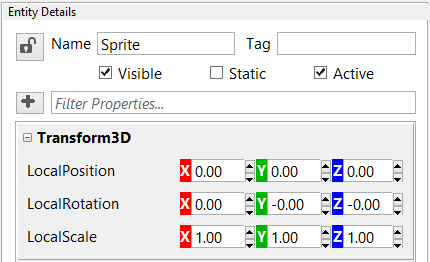
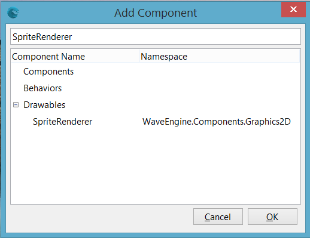

## Goal

Wave Engine is based on [entity-oriented programming](http://cowboyprogramming.com/2007/01/05/evolve-your-heirachy/). An entity is built of components, where each component does just an specific piece of work, and are reusable on other entities.

We will learn which types of components are available, and how those can be added to an entity.

## Hands-on

### With Visual Studio/Xamarin Studio

[Component](xref:WaveEngine.Framework.Component) class is the base one of every component at Wave Engine. Its goal is to store pure data (for example, which is the current health of an enemy). There are two derived classes which are broadly used along the engine, appart from on games and apps done with it. Such are:
* [Behavior](xref:WaveEngine.Framework.Behavior): it is thought to add logic to the parent entity. It provides an [Update()](xref:WaveEngine.Framework.Behavior.Update(System.TimeSpan)) abstract method which is executed on each game loop.
* [Drawable](xref:WaveEngine.Framework.Drawable): in charge of drawing pixels on the screen. In the same way as above one, this provides a [Draw()](xref:WaveEngine.Framework.Drawable.Draw(System.TimeSpan)) abstract method where custom rendering is done.

Those components are added to an [Entity](xref:WaveEngine.Framework.Entity) through the [Entity.AddComponent()](xref:WaveEngine.Framework.Entity.AddComponent(WaveEngine.Framework.Component)) method. Such can be chained (it is defined following a fluent API style), resulting in something similar to:

```c#
var sprite = new Entity("Sprite") 
	.AddComponent(new Sprite("Content/Texture.wpk")) 
	.AddComponent(new SpriteRenderer(DefaultLayers.Alpha)) 
	.AddComponent(new Transform2D()); 
```

, where [SpriteRenderer](xref:WaveEngine.Components.Graphics2D.SpriteRenderer) derives from `Drawable` and both [Sprite](xref:WaveEngine.Components.Graphics2D.Sprite) and [Transform2D](xref:WaveEngine.Framework.Graphics.Transform2D) from `Component`.


_Example of entities (left) and components (top), and how those last ones are shared across multiple entities. Image taken from Mick West's [Evolve Your Hierarchy](http://cowboyprogramming.com/2007/01/05/evolve-your-heirachy/)_

Once we have learned the basics at a low level, we will continue with the visual approach.

### With Wave Visual Editor

First of all, create a new project, and add an empty Entity to the current scene.


Coming up next, rename it, and add Components by using the Entity Details panel. Remember each empty Entity added to your scene, it will come along with Transform2D/Transform3D, enabling to set its position easily within the editor.



Using the '+' button from the Entity Details panel, add a "Sprite" Component, and a "SpriteRenderer" one.



Last, but not least, set a DefaultTexture to the Sprite within the Components panel, and double check the SpriteRenderer's LayerType property is set to Alpha.


## Wrap-up

We have seen how an `Entity` can be populated with `Component` objects, which are used to manage information about its parent. We have gone through `Behavior` and `Drawable` ones, which support logic and paint capabilities respectivelly.