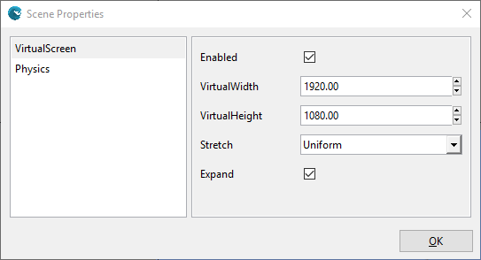
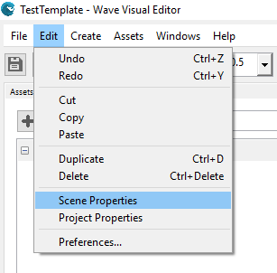

## Goal

The screen manager is in charge of translating how a scene is drawn "logically" (or virtually) to actually into your physical screen. For example, a scene can have a definition of 1080x1920 px for a mobile device with the same resolution; however, you may want to have a pixel aesthetic so your scene is virtually drawn into 270x480 px (1/4 from the original) and escalated to Full HD in the final device.

Since Wave Engine 2.0.5 the screen manager is configured at scene level, instead of the whole game, i.e. each scene can set its screen properties independently. If you have an existing project made with Wave Engine previous to 2.0.5, you may want to read [this guide](http://blogs.plainconcepts.com/waveengineteam/2016/02/01/whats-new-in-wave-2-0-5/) on how to move to 2.0.5 or upper.

In this guide you will learn how to customize a scene's virtual screen manager, both visually and through code.

## Hands-on

### With Wave Visual Editor

Click on Edit, Scene Properties on the main menu.



Then, in the Scene Properties dialog, click on the VirtualScreen section.



One important property is [Stretch](xref:WaveEngine.Framework.Managers.StretchMode). Such configures how the scene will be rendered regarding the actual screen:


In that section you can configure all the VirtualScreen properties, then click OK. This information will be stored in your scene file (.wscene).

### With Visual Studio / Xamarin Studio

To setup the [VirtualScreenManager](xref:WaveEngine.Framework.Managers.VirtualScreenManager) just call its [Activate()](xref:WaveEngine.Framework.Managers.VirtualScreenManager.Activate(System.Single,System.Single,WaveEngine.Framework.Managers.StretchMode,System.Boolean)) method anytime. For example, you can write this code into your `Scene.CreateScene()` method:

```c#
this.Scene.VirtualScreenManager.Activate(1920, 1080, StretchMode.Uniform);
```

In addition, you can change any of its values in real time (now they have [setters](xref:WaveEngine.Framework.Managers.VirtualScreenManager#properties))

```c#
this.VirtualScreenManager.Stretch = StretchMode.Fill;
```

## Wrap-up

You have learned how to configure the virtual screen manager per scene, which is the new behavior since Wave Engine 2.0.5. Previously, it was configured at game level.