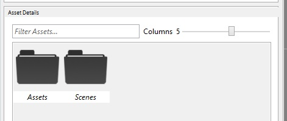
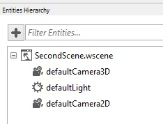

## Goal

Wave Engine is made up of scenes. An scene is a logical container where entities live in, and is represented through a camera. By default, Wave Visual Editor creates an initial one but, probably, a game will need more than just such. You can imagine a first scene with the game menu, tapping on "New game" and going to a new scene with the game it-self, for instance.

Within the following paragraphs you will learn how to add a new scene to your game, both from Wave Visual Editor or your favorite IDE.

## Hands-on

### With Wave Visual Editor

Once you have a project in Wave Visual Editor, look for the Asset Details panel:



Double click on Scenes folder. Such contains all those serialized as .wscene -XML actually-, which are later referenced from source code.

In a similar way as the white area behaves when right-clicking on it, at Windows Explorer or Mac OS X Finder, act in the same way within Asset Details, and choose Create Scene.


Type a name when asked, for example "SecondScene".

Finally, double clicking on it, the Entities Hierarchy panel will be populated with every entity the scene has:



### With Visual Studio/Xamarin Studio

After openning the C# solution, add a new class to the Shared Project (actually, the one ending with "Source"):

```c#
public class SecondScene : Scene
{
    protected override void CreateScene()
    {            
    }
}
```

Such inherits [Scene](xref:WaveEngine.Framework.Scene), and forces the parent to override [CreateScene()](xref:WaveEngine.Framework.Scene.CreateScene) method. Here, should happen the initialization code, such like entities creation, positioning, etc.

Please, note this scene is absolutely empty, with no entities nor components inside. It is worth mentioning the main difference with an scene created from Wave Visual Editor, which just adds the line

```c#
this.Load(WaveContent.Scenes.MyScene);
```

within `Scene.CreateScene()`, to deserialize the .wscene file and set everything inside up.

## Wrap-up

We have learned how to add a new `Scene` to our project, through the different approaches taken from Wave Visual Editor and Visual Studio/Xamarin Studio.
