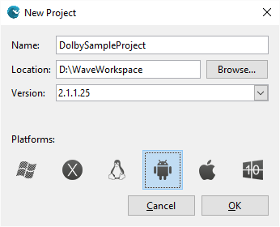
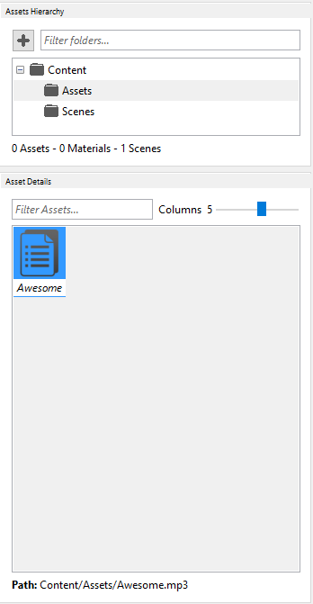

## Goal 
 
Within this recipe you will learn how to include Dolby capabilities to your games. Only Dolby capable devices can use the benefits of Dolby but you don’t need to implement different code by device.
 
## Hands-on 
Note: Dolby feature is a Wave Engine extension and we need to some code to make it work. Dolby extension will only support music (.mp3) files to play.
 
### In Wave Visual Editor 

One of the first things you are asked for when creating a new project is which profiles (and platforms) it will target.



Pick your favorite music file (.mp3) from disk and drag it in Assets Folder of the Project.



### In Visual Studio/Xamarin Studio 

Open Manage NuGet packages tab from project and install WaveEngine.Dolby extension:


Now you only must register Dolby service in WaveServices and use it wherever you need (Only register once).  In this recipe we will play music from main scene so open MyScene.cs file from project source and copy the next code in CreateScene() method:

```c#
var dolbyService = new DolbyService();
WaveServices.RegisterService(dolbyService);

var music = new MusicInfo(WaveContent.Assets.Awesome_mp3);
WaveServices.MusicPlayer.Play(music);
```

Just build and Run to start music play using Dolby capabilities where is available.
 
## Wrap-up

We have learned how to play music using Dolby features on Dolby capable devices.