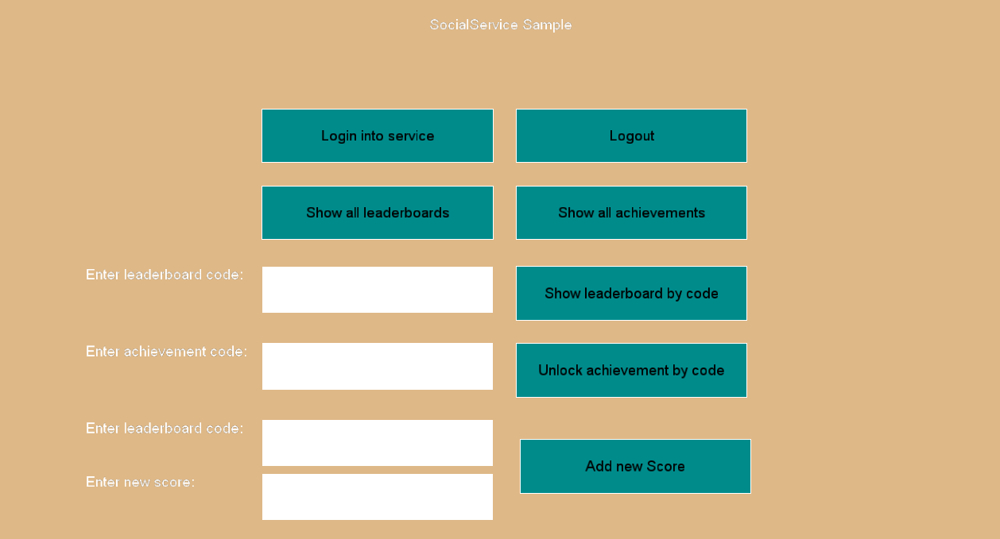
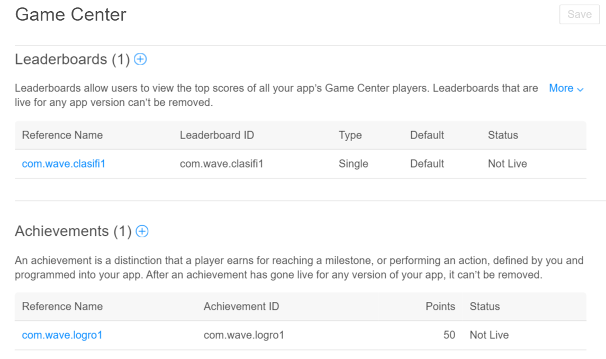

## Goal 
 
Within this recipe you will learn how to integrate your game with Google Play and Game Center.
WaveEngine.Social extension provides you a cross-platform Wave service to consult, upload and boast about player achievements and new scores.
 
## Hands-on 
### With Visual Studio/Xamarin Studio 

We will be using the [SocialService sample](https://github.com/WaveEngine/Samples/tree/master/Extensions/SocialService) as a starting point to discover how to use it.  

First things first, download the previous sample and run the Windows solution.
You will see a windows show up with this cute design.



This game exposes a UI which lets you interact and run some of the supported actions that `SocialService` provides, as Log in or Show all leaderboards.

In order to use `SocialService` programatically we need to add a reference to [WaveEngine.Social](https://www.nuget.org/packages/WaveEngine.Social/) nuget package.

Register the `SocialService` in the `Initialize` method of Game.cs file:

```C#
WaveServices.RegisterService(new SocialService());
```
 
`SocialService` works across all WaveEngine supported platfoms in simulation mode.
For Android and iOS, with the SimulationMode property disabled, social service will get connected to Google Play and Game Center services respectively. It's that easy!

```c#
var socialService = new WaveEngine.Framework.Services.SocialService
{
	SimulationMode = true
};
```	
	
SocialService provides wrapping objects for Google Play and Game Center leaderboards, achivements and scores, so you first need to register all your game leaderboards and achivements in your app Panel.

Once you finish, you will have all your leaderboard and achievements codes available to be used with `SocialService`.



Let's have a look at the prototype of the `SocialService`:

```c#
public class SocialService : Service
{
	public SocialService();

	public bool SimulationMode { get; set; }

	public void Initialize(Dictionary<string, string> properties);
	public Task<bool> Login();
	public Task<bool> Logout();
	
	public Task<List<Achievement>> GetAchievements();
	public Task<Dictionary<string, List<LeaderboardScore>>> GetTopScoresFromLeaderboard(string leaderboardCode);
	
	public Task<bool> AddNewScore(string leaderboardCode, long score);
	public Task<bool> IncrementAchievement(string achievementCode, int progress);
	public Task<bool> UnlockAchievement(string achievementCode);

	public Task<bool> ShowAchievements();
	public Task<bool> ShowAllLeaderboards();
	public Task<bool> ShowLeaderboard(string leaderboardCode);
	
	protected override void Initialize();
	protected override void Terminate();
}
```
I hope that just by reading it you could imagine every property and method is responsible for.


To start working with SocialService we need to `Initialize` it and them call `Login`. If you invoke the `Login` method on an iOS app you will this screen appears requesting your Game Center credentials.


Once the user finish with the login, you could call other social actions, for example `AddNewScore`, providing the leaderboardCode you registered previously on you app Panel.

Beware all methods comes in a Async fashion.


## Wrap-up

We have seen how the Social service could be used to send new achievements, scores and update leaderboards.
A simple Social service sample was shown in which developers could test and familiarize with it.
