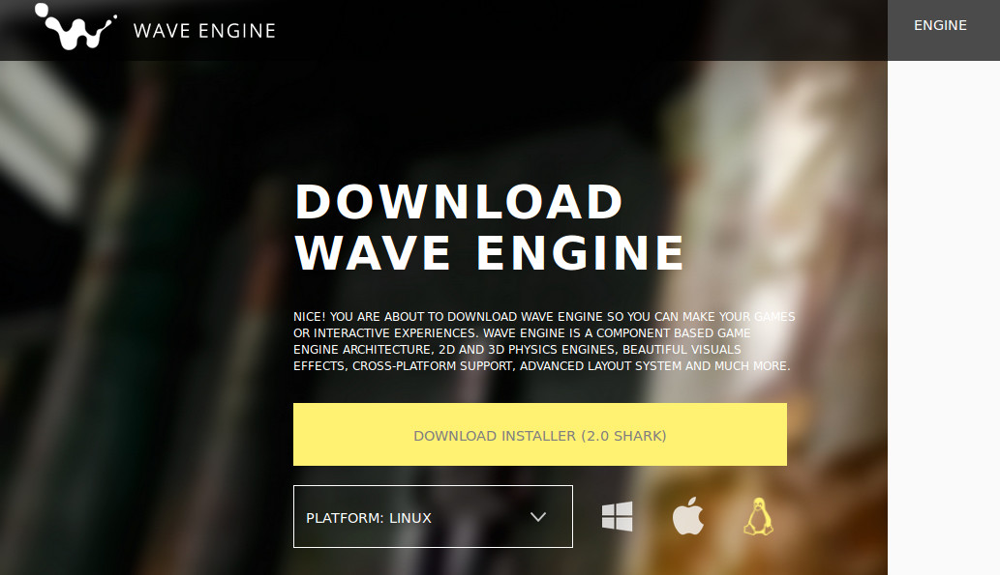

# Quick Start Video

Getting Started with Wave Engine on Linux (Ubuntu):

# Prerequisites

## IDE

You need to install [MonoDevelop](http://monodevelop.com/) 5.9 or higher to develop with Wave Engine.
Most Linux distributions include an earlier version of MonoDevelop, so you need to install it from the Mono official package repository.

### Installing MonoDevelop

Follow the instructions given in the official Mono page: [Install Mono on Linux](http://www.mono-project.com/docs/getting-started/install/linux/#debian-ubuntu-and-derivatives)

In brief, if you are running on Ubuntu, execute the following commands on a console:

    $ sudo apt-key adv --keyserver hkp://keyserver.ubuntu.com:80 --recv-keys 3FA7E0328081BFF6A14DA29AA6A19B38D3D831EF    
    $ echo "deb http://download.mono-project.com/repo/debian wheezy main" | sudo tee /etc/apt/sources.list.d/mono-xamarin.list    
    $ sudo apt-get update    
    $ sudo apt-get install monodevelop  

### Launching MonoDevelop

To open MonoDevelop, please execute the following command on a console:

    $ monodevelop

It is recommended to create a shotcut anywhere on the desktop to access it more easily. Please refer to your corresponding Window Manager to gather how it is done.

## NuGet Certificates

[NuGet](https://www.nuget.org/) is the package manager for the .NET development platform. Most Linux distributions do not trust on NuGet or Microsoft's websites certificates, so you need to import the latests into the machine store. Below commands will do just that, within a console:

    $ sudo mozroots --import --machine --sync
    $ sudo certmgr -ssl -m https://go.microsoft.com
    $ sudo certmgr -ssl -m https://nugetgallery.blob.core.windows.net
    $ sudo certmgr -ssl -m https://nuget.org

# Install Wave Engine

Visit the official [Wave Engine](https://waveengine.net/) web-site, click on Download Wave Engine button (it will redirect to the [Download](http://waveengine.net/Downloads) page) and finally Download Installer one. Please assure the platform below is Linux.

Double click on it if you are on Ubuntu, and a friendly setup process will handle the installation. If you are running a different Linux distribution, please refer to the on-line documentation on how to proceed with a .deb file.

Finally, after the installation ends, you will find Wave Editor application right there on the list:

# Create a Wave Engine Account

The first time you open Wave Visual Editor you will be asked for an user account.

If you click on Create a new Account, the browser will take you to the [join form](http://waveengine.net/account/register).

Please, fill such in and click on Submit. You should immediately receive a confirmation e-mail. Congratulations! You can now login into the Editor and proceed with your first application.

# Your First Application

Please, navigate to [My First Application](My-First-Application.md).

# FAQ

 - **Q: WaveEditor crash when I create a new project, and I'm using Monodevelop 5.5 or earlier:** 
 - **A:** Install MonoDevelop 5.9 or a higher version. Earlier versions like 5.5 contains a Bug in mono runtime that causes a crash in WaveEditor: [Bug 24084](https://bugzilla.xamarin.com/show_bug.cgi?id=24084)

_If you find any question which may fit here, please [contact us](https://waveengine.net/Company#Contact)._