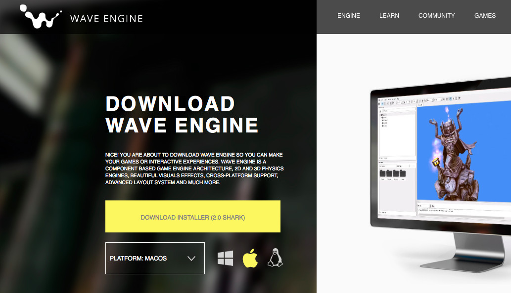
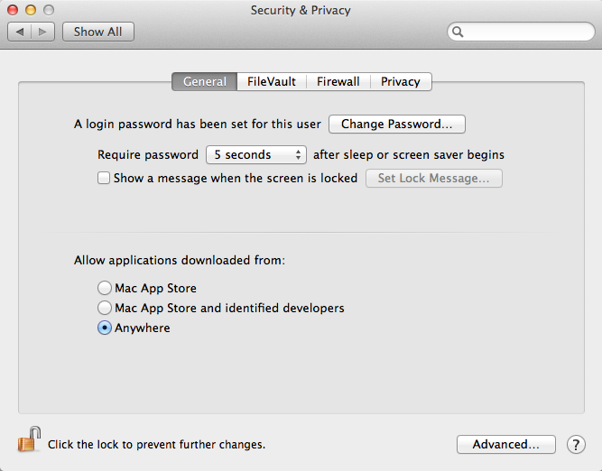
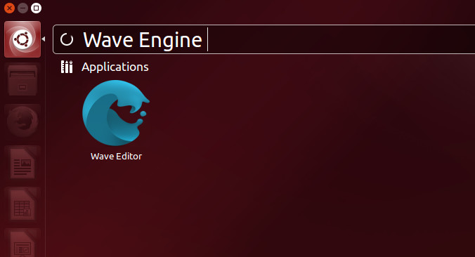

# Quick Start Video

Getting Started with Wave Engine on Mac OS X:

# Prerequisites

## IDE

You need to install [Xamarin Studio](https://xamarin.com/studio) to develop with Wave Engine on Mac OS X. _Xamarin Studio comes with Xamarin_, which can be downloaded [here](https://xamarin.com/download).

# Install Wave Engine

Visit the official [Wave Engine](https://waveengine.net/) web-site, click on Download Wave Engine button (it will redirect to the [Download](http://waveengine.net/Download) page) and finally Download Installer one. Please assure the platform below is Mac OS.

Open the downloaded file, and a friendly setup process will handle the installation. 

>[!Warning] 
>If you are unable to install the WaveEngine, you might see the following message "_This app can't  be opened because it is from an unidentified developer_" Then you need to allow install apps in your system download outside from apple store.

You can easily fix this by navigating to **System Preferences-> Security & Privacy**
![Wave Preferences Mac] (images/Preferences.png)

The security & Privacy windows will open:

In this "**General**" tab, click the little lock icon in the botton left of the windows to unlock making changes.
Now select "**Anywhere**" under "_Allow applications downloaded from:_"

Finally try to install again.
 

Finally, after the installation ends, you will find WaveEditor within Applications directory:

# Create a Wave Engine Account

The first time you open Wave Visual Editor you will be asked for an user account.

![Wave Mac Login] (images/MacOSLogin.jpg)

If you click on Create a new Account, the browser will take you to the [join form](http://waveengine.net/account/register).

Please, fill such in and click on Submit. You should immediately receive a confirmation e-mail. Congratulations! You can now login into the Editor and proceed with your first application.

# Your First Application

Please, navigate to [My First Application](My-First-Application.md).

# FAQ

_This section is empty currently. If you find any question which may fit here, please [contact us](https://waveengine.net/Company#Contact)._