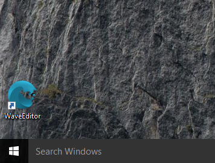

# Quick Start Video

Getting Started with Wave Engine on Windows:

# Prerequisites

Every prerequisite is installed by Wave Engine installer, detecting whether it is already present on the OS. However, may occur errors with the automatic detection. In such case, please find the list below to download and install those manually:

 - [DirectX redistributable](http://www.microsoft.com/en-us/download/details.aspx?id=8109)
 - [.NET Framework 4.5.1](http://www.microsoft.com/en-us/download/details.aspx?id=40773)
 - [GTK#](http://download.xamarin.com/GTKforWindows/Windows/gtk-sharp-2.12.26.msi)
 - [Microsoft Build Tools 2015](http://www.microsoft.com/en-us/download/details.aspx?id=48159)
 - [Visual C++ Redistributable for Visual Studio 2012 Update 4](http://www.microsoft.com/en-US/download/details.aspx?id=30679)

## IDE

> [!Note] 
> Starting with Wave Engine 2.0, Wave Visual Editor handles the Visual Studio C# solution creation, removing the templates existing on previous version of the product. 

[Visual Studio Express/Community](http://www.visualstudio.com/products/visual-studio-express-vs) (free of charge) if you target Windows Desktop, Windows Store or Windows Phone apps. If you want to work with Android or iOS, you will need the [Professional](https://www.visualstudio.com/products/visual-studio-professional-with-msdn-vs) edition or higher. [Xamarin Studio](http://xamarin.com/studio) is also supported, and allows to work with Android and iOS from Windows it-self.

# Install Wave Engine

Visit the official [Wave Engine](https://waveengine.net/) web-site, click on Download Wave Engine button (it will redirect to the [Download](http://waveengine.net/Download) page) and finally Download Installer one. Please assure the platform below is Windows.

Launch the setup file, it will firstly install the prerequisites followed by a common setup process at Windows.

Once the setup ends, you will find a Wave Visual Editor shortcut on your Desktop, which you can open through a double-click on it.

# Create a Wave Engine Account

The first time you open Wave Visual Editor you will be asked for an user account.

If you click on Create a new Account, the browser will take you to the [join form](http://waveengine.net/account/register).

Please, fill such in and click on Submit. You should immediately receive a confirmation e-mail. Congratulations! You can now login into the Editor and proceed with your first application.

# Your First Application

Please, navigate to [My First Application](My-First-Application.md).

# FAQ

_This section is empty currently. If you find any question which may fit here, please [contact us](https://waveengine.net/Company#Contact)._