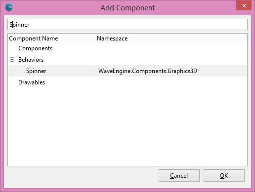
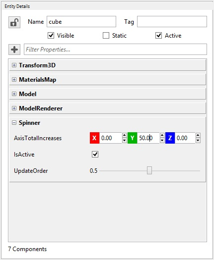

## Goal

> [!Note]
> Have you already installed Wave Engine? If not, please go through the Getting Started series ([Windows](Getting-Started-on-Windows.md), [Mac OS X](Getting-Started-on-Mac-OS-X.md) or [Linux](Getting-Started-on-Linux.md) prior to keep reading.

It is likely to happen you have just installed Wave Engine, and want to start working on your first application. Although Wave Engine is though with games in mind, it is powerful enough to work on more general apps, likely those involving animated graphics.

This guide will show you how to create a 3D rotating cube, which can be understood as the Hello World in the games development world.

## Hands-on

### With Wave Visual Editor

Open Wave Visual Editor (it may happen the shortcut is named Wave Editor), click on File, New Project. Proceed filling the required gaps in.

Within Entities Hierarchy panel, click on the '+' button and add a Cube, from Primitives 3D:


Double check above "cube" entity is selected in Entities Hierarchy. Go to Entity Details panel and click on the '+' button to add a component.

At the Add Component dialog, type "spinner", select the [Spinner](xref:WaveEngine.Components.Graphics3D.Spinner) behavior and click OK.



Within Entity Details panel, scroll to the `Spinner` behavior and modify `AxisTotalIncreases`' Y coordinate to 50.



Finally, click on Build or Simulate () to see your first application in action.

### With Visual Studio/Xamarin Studio

Previously to Wave Engine 2.0, both Visual Studio and Xamarin Studio had their own project templates. Since 2.0, Wave Engine projects are created within Wave Visual Editor, accessing to those through File, Open C# Solution.

Open MyScene.cs class, and add this snippet to `CreateScene()`:

```C#
protected override void CreateScene()
{
    this.Load(WaveContent.Scenes.MyScene);           

    var cube = new Entity()
        .AddComponent(new Transform3D())
        .AddComponent(new MaterialsMap())
        .AddComponent(Model.CreateCube())
        .AddComponent(new ModelRenderer())
        .AddComponent(new Spinner()
        {
            AxisTotalIncreases = new Vector3(0, MathHelper.ToRadians(50), 0)
        });
    this.EntityManager.Add(cube);
}
```

## Wrap-up

Congratulations! You have successfully created your first application.

We hope it is the beginning of a wonderful experience. -_Wave Engine Team_