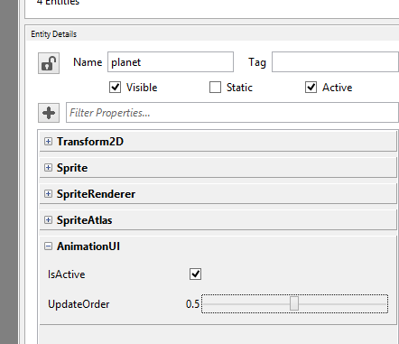

## Goal

Animations, nowadays, can be the difference between a poor-looking static app, or a wonderful fluid experience. Just an example: a loading screen in a game can gain value for our users, and make them perceive even less waiting time that the real one, by avoiding the classic "Loading, please wait..." static text to a set of animations for that same label: fade in, fade out, fade in, and so this way.

Wave Engine comes with an animation system which makes those tasks particularly easy. Within this recipe you will learn to apply animations to properties in 2D components.

## Hands-on

As a prerequisite for this guide follow [Load a Sprite (Image)](Load-a-Sprite-(Image).md) to create a project with a single sprite.

### With Wave Visual Editor

Add an [AnimationUI](xref:WaveEngine.Framework.Animation.AnimationUI) component to the sprite.



This is all you can do with Wave Visual Editor for now. In order to follow applying animations, please continue reading below.

### With Visual Studio/Xamarin Studio

Add an [AnimationUI](xref:WaveEngine.Framework.Animation.AnimationUI) component to the entity you have defined:

```c#
var sprite = new Entity()
    .AddComponent(new Transform2D())
    .AddComponent(new Sprite(WaveContent.Assets.tree_png))
    .AddComponent(new SpriteRenderer())
    // Add this line more specifically
    .AddComponent(new AnimationUI());
this.EntityManager.Add(sprite);
```

We would like the sprite to animate horizontally from position 0 to 300, during 2 s, with a back easing function. [SingleAnimation](xref:WaveEngine.Framework.Animation.SingleAnimation) will handle the animation parameters, except on which property it will be executed (which will see just after), including the [EasingFunctions](xref:WaveEngine.Framework.Animation.EasingFunctions). Wave Engine supports by default multiple easing functions (click on previous link), although it can be extended to create new ones.

Create firstly the animation:

```c#
var animation = new SingleAnimation(0, 300, 2, EasingFunctions.Back);
```

In order to apply the animation to our sprite's X position, `AnimationUI` is back in scene. [Transform2D's properties](xref:WaveEngine.Framework.Graphics.Transform2D#properties) has definitions which simplify this last step:

```c#
var animationUi = sprite.FindComponent<AnimationUI>();
animationUi.BeginAnimation(Transform2D.XProperty, animation);
```

## Wrap-up

You have learned how to apply animations to 2D components in Wave Engine.