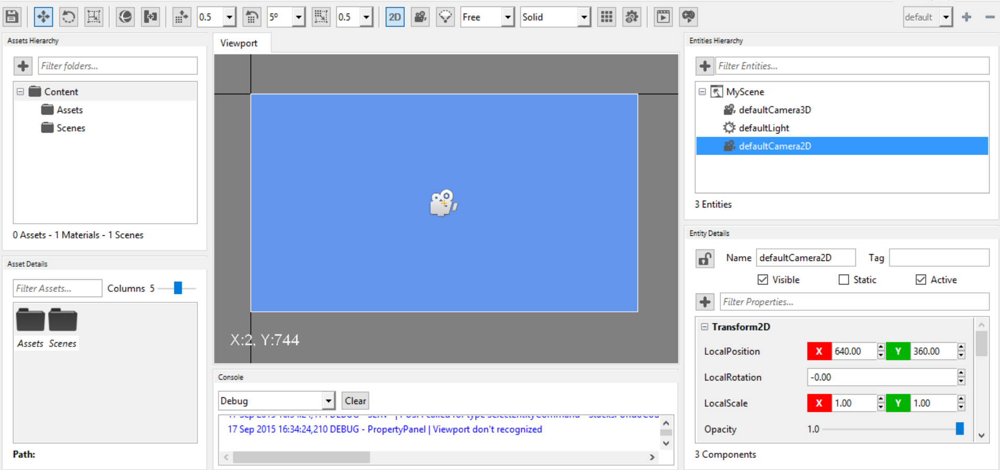

## Goal 

Cameras in games are the eyes through we see the virtual world. Within this recipe you will learn how to create a 2D camera in Wave Engine.
 
## Hands-on 
 
### With Wave Visual Editor 

As you would had found, default Wave Visual Editor template comes with a predefined scene and a few entities: both 2D and 3D cameras and a light.

In order to work in 2D mode within the Editor you first need to use the corresponding toolbar button to enable it:


Then, just select your brand new [Camera2D](xref:WaveEngine.Framework.Graphics.Camera2D) and customize its properties just below, at Entity Details.



### With Visual Studio/Xamarin Studio 

Let us move now to our beloved code: open the C# Solution associated to your project and add a [FixedCamera2D](xref:WaveEngine.Components.Cameras.FixedCamera2D) to the scene:

```c#
var camera2d = new FixedCamera2D("defaultCamera2D");
this.EntityManager.Add(camera2d);
```

## Wrap-up

We have seen how a 2D camera can be added to a scene, and set the 2D mode inside Wave Visual Editor. 
Finally, we have gone through code to do the same steps as well.

