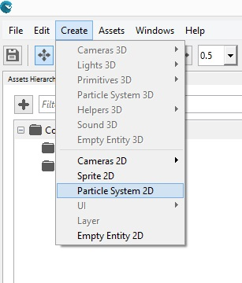
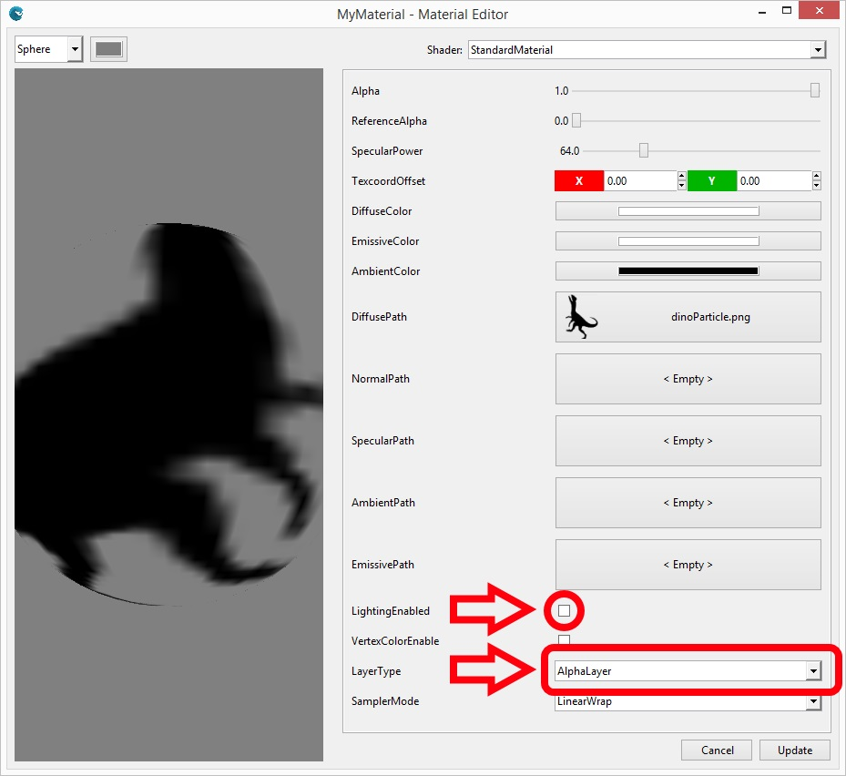

## Goal

Particles allow us to give dynamism to a game by creating good-looking effects. The well-know example of [Braid](http://braid-game.com/) does a heavy use of 2D particles, where even the backgrounds were done using this technique. We will learn how to create a 2D particle system with Wave Engine, and how to customize it looking to fit our effect needs.

## Hands-on

Creating a particle system involves two different tasks:
 * the particle system definition it-self: how the particles will behave
 * the `Entity` which renders the above particle system on a position on screen

### Using Wave Visual Editor

Open or create a WaveEngine project in Wave Visual Editor:

Set the Editor in 2D mode in the icon .

Open the Create menu and select the Particle System 2D:



Create a Material to the particles and set it at the Particle Entity Material.
> [!IMPORTANT]
> Set the Material 'LightingEnabled' Property to false and set the Material 'LayerType' Property to AlphaLayer.



Now you can configure the ParticleSystem2D Component from the Entity:

* **Emit**: True to emmit particles.
* **NumParticles**: Max particles at same time.
* **EmmiterShape**: [Rectangle|FillRectangle|Circle|FillCircle] The shape that the emitter will have.
* **EmitRate**: Particles per second.
* **SortEnabled**: Enable sorting.
* **LocalVelocity**: particle global velocity
* **RandomVelocity**: velocity variation (different every particle).
* **Gravity**: global acceleration.
* **InitialAngle**: Angle for a particle (initial).
* **InitialAngleVariation**: Angle variation for every particle (initial).
* **MinRotateSpeed/MaxRotateSpeed**: Modifies rotation speed by particle.
* **MinSize/MaxSize**: Modifies size by particle.
* **EndDeltaScale**: Scale value on the end of the particle live.
* **MinLife/MaxLife**: Time to live of every particle.
* **LinearColorEnabled**: Change the particle color in the particle's live.
* **MinColor/MaxColor**: Color selection.
* **AlphaEnabled**: True for allow transparency in particles.
* **CollisionType**: [None|Bottom|Top|Left|Right] Enables particle collision in a rectangle defined by CollisionMin/CollisionMax properties.
* **CollisionMin/CollisionMax**: Defines a Rectangle to collision.
* **CollisionSpread**: Defines the particle spread in the collision.
* **CollisionBehavior**: [Die|Bounce] Selected what happend on collision.
* **Bouncines**: When CollisionBehavior is Bounce this property defines the bounciness of the particle.


### Using Visual Studio/Xamarin Studio

Open or create a WaveEngine project in Wave Visual Editor, import the particle asset and create the material to particles:

Import the namespace in scene class:

```c#
using WaveEngine.Components.Particles;
```

Building the entity:
 
```c#
var entity = new Entity()
	.AddComponent(new Transform2D())
	// ParticleSyste2D Requires a MaterialsMap
	.AddComponent(new MaterialsMap(new StandardMaterial()
	{
		DiffusePath = WaveContent.Assets.dinoParticle_png,
		LightingEnabled = false,
		LayerType = DefaultLayers.Alpha
	}))
	// Set some particle properties
	.AddComponent(new ParticleSystem2D()
	{
		// Amount of particles drawn on a game loop
		NumParticles = 200,
		// Amount of particles emited per second
		EmitRate = 1500,
		// Minimum time a particle will be alive
		MinLife = 1,
		// Maximum time a particle will be alive
		MaxLife = 3,
		// 2D vector containing the local velocity a particle will take
		LocalVelocity = new Vector2(0.4f, -2f),
		// 2D vector containing a random velocity applied to the local one
		RandomVelocity = new Vector2(2f, 1.5f),
		// Minimum size of the particle
		MinSize = 15,
		// Maximum size of the particle
		MaxSize = 40,
		// Minimum rotation speed for a particle
		MinRotateSpeed = 0.03f,
		// Maximum rotation speed for a particle
		MaxRotateSpeed = -0.03f,
		// Delta scale applied during the particle's life
		EndDeltaScale = 0f,
		// Size the emitter will fit in during execution
		EmitterSize = new Vector3(30),
		// Gravity applied to each particle
		Gravity = new Vector2(0, 0.03f),
		// Shape the emitter will form during execution
		EmitterShape = ParticleSystem2D.Shape.FillCircle
		// You can set here every property you need
	})
	.AddComponent(new ParticleSystemRenderer2D());

	this.EntityManager.Add(entity);
```

## Wrap-up

Within this recipe we have created an effect through 2D particles.