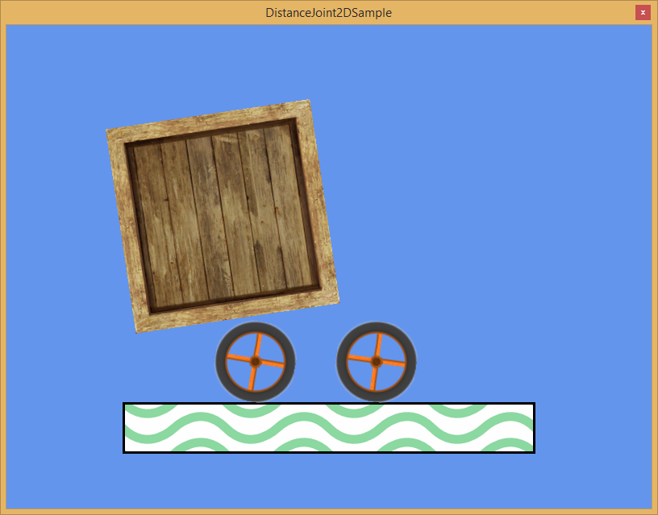

## Goal

A joint in physics is a relationship between two different objects. Such is a base behaviour when working with physics, and [Wave Engine](http://waveengine.net) supports multiple types of 2D joints.

This recipe will briefly summarise all of the available 2D joints, showing how are handled in code in general aspects. We will see how a distance joint results in game.

## Hands-on

Every 2D joint inherits from abstract class [WaveEngine.Framework.Physics2D.Joint2D](xref:WWaveEngine.Framework.Physics2D.Joint2D`2). Wave Engine supplies currently the following implementations:
 - [AngleJoint2D](xref:WaveEngine.Framework.Physics2D.AngleJoint2D): the joined entity’s angle is replicated on the original entity.
 - [DistanceJoint2D](xref:WaveEngine.Framework.Physics2D.DistanceJoint2D): the distance between joined entity and original one is kept during the scene’s life.
 - [FixedJoint2D](xref:WaveEngine.Framework.Physics2D.FixedJoint2D): rigid relationship between two entities.
 - [FixedMouseJoint2D](xref:WaveEngine.Framework.Physics2D.FixedMouseJoint2D): establishes a joint between the original entity and the mouse/finger being dragged along the screen (i.e. the entity follows the dragging).
 - [PrismaticJoint2D](xref:WaveEngine.Framework.Physics2D.PrismaticJoint2D): limits the movement between entities along the specified axis (i.e. in the same way an slider works).
 - [RevoluteJoint2D](xref:WaveEngine.Framework.Physics2D.RevoluteJoint2D): creates a dependency between two entities where the distance is fixed and each one of them can rotate along the respective anchors.

### With Wave Visual Editor

For example, we will use the [DistanceJoint2DSample](https://github.com/WaveEngine/Samples/tree/master/Physics2D/DistanceJoint2DSample) from the Samples repository, where two wheels are joined through a `DistanceJoint2D`:

In the scene where we have the two entities, select the one of and add a `Joint2DMap` component using the `Add component` button in the `Entity Details` panel. In the property list, you can se a new property called `Joints`. Using the `Dictionary button` when can create and add new joints:


As you can see, adding a joint allows to select the joint type and the connected entity from the scene.

### With Visual Studio/Xamarin Studio

To recreate the previous sample using code, whe need create the two entities and the JointMap2D as a component of one of them.

```c#
Entity Wheel1 = new Entity("wheel1")
	.AddComponent(new Transform2D() { X = 300, Y = 400, Origin = Vector2.Center })
	.AddComponent(new CircleCollider2D())
	.AddComponent(new Sprite("Content/Wheel.wpk"))
	.AddComponent(new RigidBody2D())
	.AddComponent(new SpriteRenderer(DefaultLayers.Alpha));

Entity Wheel2 = new Entity("wheel2")
	.AddComponent(new Transform2D() { X = 450, Y = 400, Origin = Vector2.Center })
	.AddComponent(new CircleCollider2D())
	.AddComponent(new Sprite("Content/Wheel.wpk"))
	.AddComponent(new RigidBody2D())
	.AddComponent(new SpriteRenderer(DefaultLayers.Alpha))
	.AddComponent(new JointMap2D().AddJoint("simpleJoint", new DistanceJoint2D(Wheel1, Vector2.Zero, Vector2.Zero)));
```

When the sample is executed, and the crate falls and touches the first wheel, the force applied to this one is translated to the second through the distance joint:



## Wrap-up

This recipe has showed us which are the available [Joint2D](xref:WaveEngine.Framework.Physics2D.Joint2D`2) in Wave Engine, how those are generically used and, more specifically, how the [DistanceJoint2D](xref:WaveEngine.Framework.Physics2D.DistanceJoint2D) works on one of our samples.