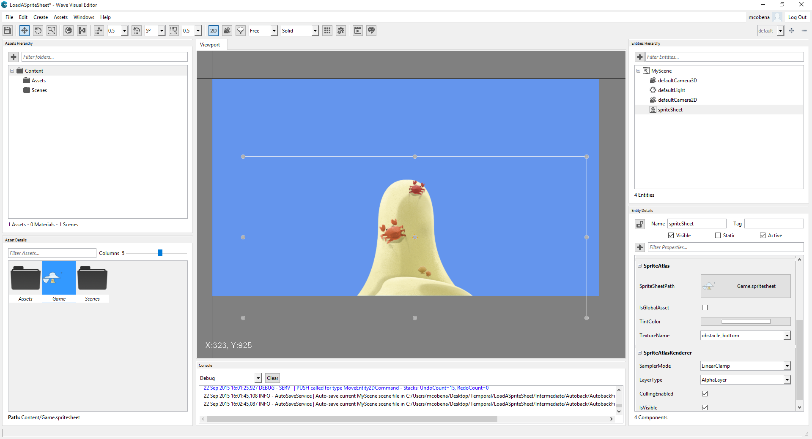
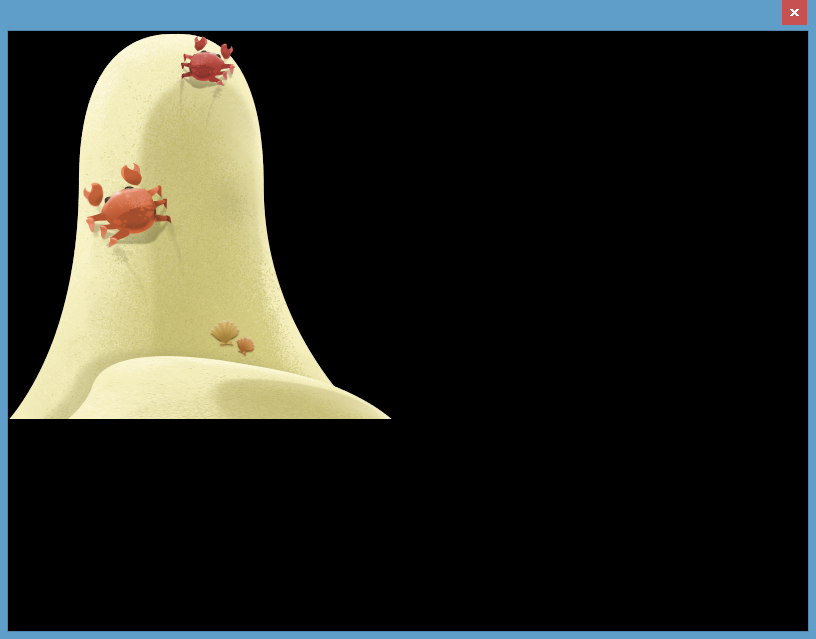

## Goal

2D games are heavily based on [sprites](https://msdn.microsoft.com/library/bb203919(v=xnagamestudio.40).aspx). Wave Engine supports to draw sprites directly from a resource (such like .png images) but, also, from an sprite sheet. The idea behind is packing as much of the resources as possible, to reduce the work on up/downloading the images to the GPU, thus improving the overall game performance. We will see how to draw images taken from an sprite sheet.

We will use the resources from [Flying Kite](https://github.com/WaveEngine/QuickStarters/tree/5b4eca7445bdf4dfcd18b1074178a82b6eac517a/FlyingKite) Quick Starter. Please, download those as we will work with them later on.

## Hands-on

### With Wave Visual Editor

Click on the '+' button located at the top left corner, under Assets Hierarchy panel. Create a new Sprite Sheet.


You will be asked for a name. Such will allow us later to refer to it from the drawing component.

The Asset Viewer built-in tool will pop-up. This one is in charge of setting up which assets will be packed into a single one, and in which way this process is done. Add the previously downloaded assets, through the "Add Sprites..." button, by navigating to the path where those were downloaded. The files will be inmediately copied to our project's path, and we will be asked to add them to the current sprite sheet. We accept this last question.


> [!Note]
> Wave Engine also supports [TexturePacker](https://www.codeandweb.com/texturepacker) XML files. Once in the Asset Viewer window, you will find the TexturePacker button below the Sprites panel at the left side.

The assets are added in alphabetical order, and thus packed into a single asset which is previewed at the center of the screen. At the right side we have multiple options which configure the resulting sheet:
* ZipCompress: whether the intermediate file generated is also zipped, reducing on-disk memory. The first time a compressed asset is loaded into a game, it is uncompressed for future access.
* MaxWidth, MaxHeight: maximum width/height, in pixels, the final asset will have.
* GenerateMipMaps: whether generate mipmaps along with the sprite sheet. You can read more on mipmaps [here](https://en.wikipedia.org/wiki/Mipmap).
* ForceSquare: whether final sprite sheet must be square or not.
* RequiresPowerOfTwo: whether sprite sheet is power of two. Usually, sizes (width and height) in the form of 2^n, are better handled by the GPUs.
* Padding: margin, in pixels, from the sprite sheet borders.
* Spacing: margin, in pixels, between one asset and the other (not between an asset and a border, which would be the Padding instead)
* OutputFormat: any of the following values: Color16bit, Color32bit (by-default one), CompressedLowQuality or CompressedHighQuality.
* KeepOrder: whether keep the order specified on the left assets list. If not, such will be automatically calculated to satisfy the values set on this list of options.

Leaving the options with their default values, we click on OK button, being back on the main window.

In order to render a single sprite from the sheet, assure first the 2D mode is selected (it can be switched between 3D/2D by clicking on the corresponding toolbar "3D", by-default value, button), and drag and drop the sprite sheet from the Asset Details panel into the Viewport one. Which specific sprite is rendered can be changed on the Entity Details panel (right bottom corner), under the Sprite Atlas component, at the TextureName property.



### With Visual Studio/Xamarin Studio

The sprite sheet creation is done with the same exact steps as above, as the Wave Visual Editor is now in charge of handling this procedure. Once the sprite sheet is ready, click on File > Open C# Solution...

Back to the code, add the following entity to an scene:

```c#
var sprite = new Entity()
    .AddComponent(new SpriteAtlas(WaveContent.Game_spritesheet, 
        WaveContent.Game_spritesheet_TextureName.obstacle_bottom))
    .AddComponent(new SpriteAtlasRenderer(DefaultLayers.Alpha))
    .AddComponent(new Transform2D());
EntityManager.Add(sprite);
```

Working with an sprite atlas involves two different components:
* [SpriteAtlas](xref:WaveEngine.Components.Graphics2D.SpriteAtlas): with the above used ctor., it handles the resource file containing the sprite atlas, and the specific sprite to be drawn later.
* [SpriteAtlasRenderer](xref:WaveEngine.Components.Graphics2D.SpriteAtlasRenderer): it takes the concrete texture from the sprite atlas, and dumps it on the layer passed through the ctor.



## Wrap-up

We have covered how to create an sprite sheet through Wave Visual Editor tool. After, we have seen how to consume such from our game, telling which exact sprite we want to draw.