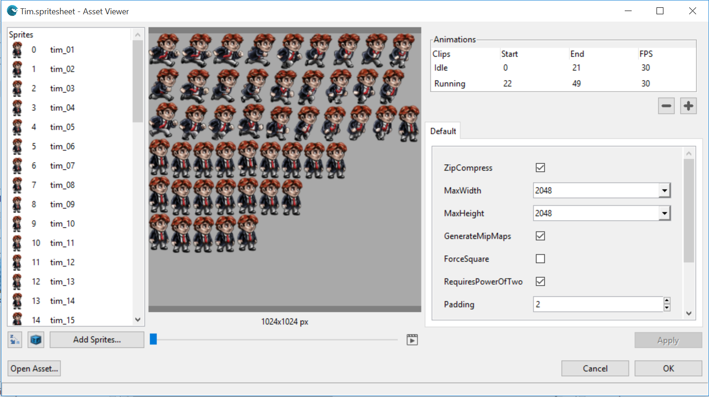
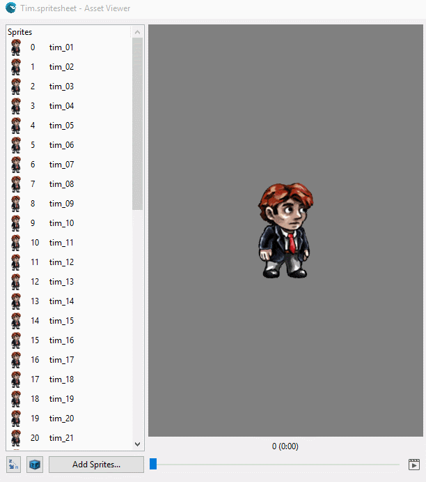

## Goal 

Within this recipe you will learn how to add an animated sprite as a wave resource and render it in a Scene.
As we learn in the [Load a Sprite Sheet](Load-a-Sprite-Sheet.md) recipe, Sprite Sheet are little storyboards of our game elements and usually covers all the possible states in a static asset.

At the end of this recipe you will learn how to add 2D animations based on Sprite Sheets.

## Hands-on 

### With Wave Visual Editor 

In order to create a new Sprite Sheet using Wave Visual Editor you need to follow the steps from the [Load a Sprite Sheet](Load-a-Sprite-Sheet.md#with-wave-visual-editor)

Each sprite represents a point in the animation timeline, these animations must be defined in the "Animations" section of the Sprite Sheet windows.

Let's have a look at an already created animation.

We will be using this demo as a starting point for this recipe: [PlatformGameDemo](https://github.com/WaveEngine/Samples/tree/master/Graphics2D/PlatformGameDemo) 

Open the Tim Sprite Sheet [Tim.spritesheet](https://github.com/WaveEngine/Samples/tree/master/Graphics2D/PlatformGameDemo/Content/Assets/Tim.spritesheet) of the PlatformGameDemo sample inside Wave Engine Editor.



As you see, there are 2 different animations inside this Sprite Sheet (Idle and Running).

You can select a range of sprites and FPS (Frames Per Seconds) for each animation.

Then you could reproduce it in the central preview panel and adjust animation parameters.

Awesome, isn't it? 



When we finished customizing animation parameters and get our Sprite Sheet done, we need to use it in a Wave scene.

We also need an `Animation2D` with the `CurrentAnimation` properly set.


That's all.
 
### With Visual Studio/Xamarin Studio 
 
 
For this recipe we will back on the corresponding sample, [PlatformGameDemo](https://github.com/WaveEngine/Samples/tree/master/Graphics2D/PlatformGameDemo).

Have a look at [Load a Sprite Sheet] (Load-a-Sprite-Sheet.md#with-visual-studioxamarin-studio) to see the componets you need to use make use of Tim's Sprite Sheet.

In order to animate our sprite sheet a `Animation2D` component is required, which is in charge of everything related to the sprite sheet animations. 
The code should look like this:

```c#
var tim = new Entity("Tim")
    .AddComponent(new Transform2D())
    .AddComponent(new SpriteAtlas(WaveContent.Assets.Tim_spritesheet))
    .AddComponent(new SpriteAtlasRenderer())
    .AddComponent(new Animation2D()
    {
        CurrentAnimation = "Idle",
        PlayAutomatically = true,
    });

EntityManager.Add(tim);
```

Adding this entity to the Scene will make Tim automatically start to reproduce its "Idle" animation. Remember breathing animation was named "Idle" in Sprite Sheet panel.

If we want to make Tim run, this can be achieved by accessing the `Animation2D` component of Tim entity and calling `PlayAnimation()`:

```c#
var anim2D = tim.FindComponent<Animation2D>();
anim2D.PlayAnimation("Running", true);
```

`PlayAnimation()` has various overloads. The one used here, simply tells the animation to play and loop the animation when it reaches the last frame.


 
_Breathing animation being played in loop mode._
 
## Wrap-up

We have seen how an animated Sprite Sheet can be added to your main scene.
We have gone through code and have learnt to use `SpriteAtlas`, `SpriteAtlasRenderer` and `Animation2D` components to render a simple animated spritesheet into a Scene.
