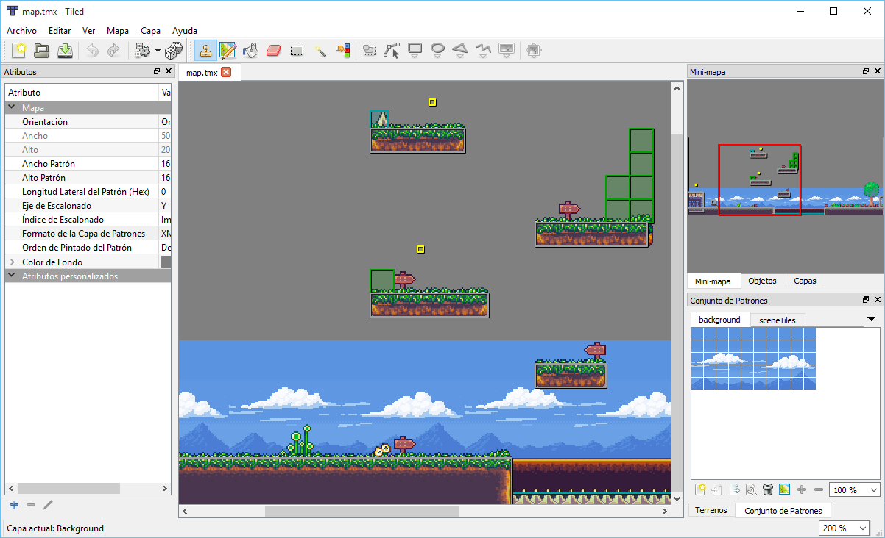
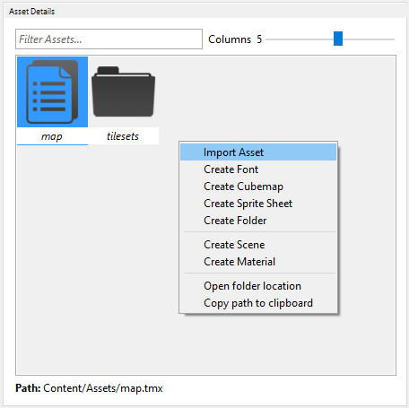
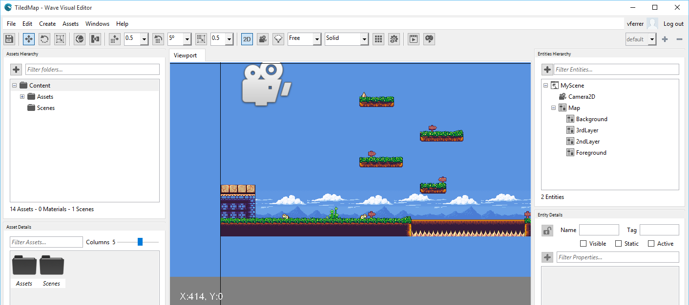

## Goal

Within this recipe we will learn how to consume a tile map exported with [Tiled Map Editor](http://www.mapeditor.org).

## Hands-on

Tiled is a great tool to create maps for your games using tiles distributed in a grid. It is very useful and popular in 2D games to design game levels. You can get more information [here](https://github.com/bjorn/tiled/wiki).


_The terrain tool screenshot._

In order to use its outputs with Wave Engine, we must add the [TMX] (http://doc.mapeditor.org/reference/tmx-map-format) file to the Wave Project from Wave Visual Editor, along with the tilesets images.

NOTE: Within this recipe we are taking the assets from [this sample](https://github.com/WaveEngine/Samples/tree/master/Extensions/TiledMap), more exactly from [here](https://github.com/WaveEngine/Samples/tree/master/Extensions/TiledMap/Content/Assets).

### Using Wave Visual Editor

Open or create a WaveEngine project in Wave Visual Editor and import, using the same directory hierarchy, all Tiled files:



Wave Engine contains a component called `TiledMap` which makes really easy to include Tiled maps. Once it points to the TMX file, a new entity hierarchy is automatically generated to represent the different layers in the map.
 
Create a new Entity and insert a `Transform2D` and a `TiledMap` components. Select this entity and update the `TmxPath` property to point the desired TMX file.


Finally, the entity must be look like this:



### Using Visual Studio/Xamarin Studio

Open or create a WaveEngine project in Wave Visual Editor and import the Tiled assets (see past chapter: "Using Wave Visual Editor" from this recipe):

**First we need to add the Nuget [WaveEngine.TiledMap] (https://www.nuget.org/packages/WaveEngine.TiledMap) reference.**

Building an entity:
 
```c#
var map = new Entity()
	.AddComponent(new Transform2D())
	.AddComponent(new TiledMap(WaveContent.Assets.map_tmx));

EntityManager.Add(map);
```


## Wrap-up

We have learned how to import a map generated with Tiled Map Editor in Wave Engine.