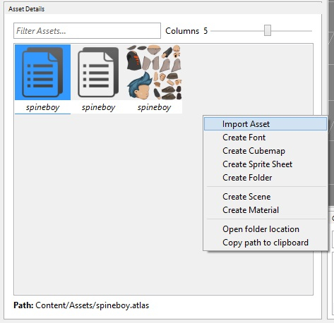
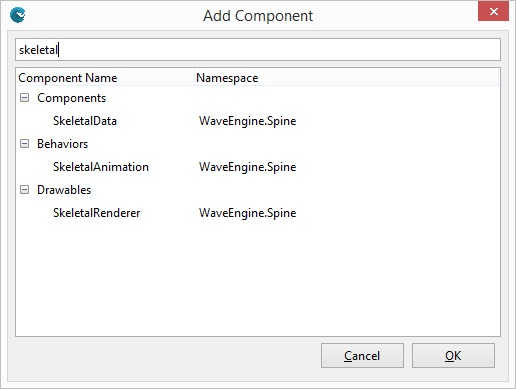
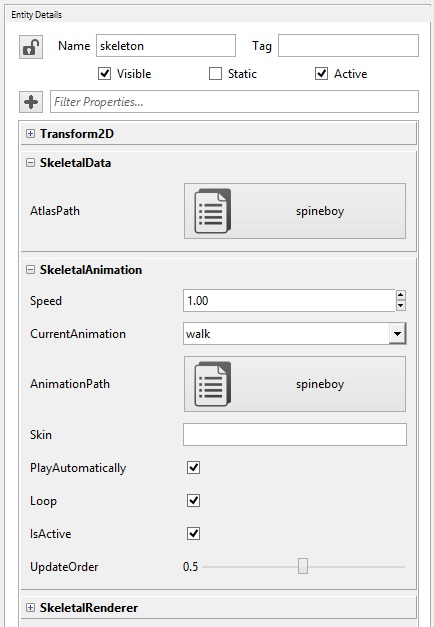
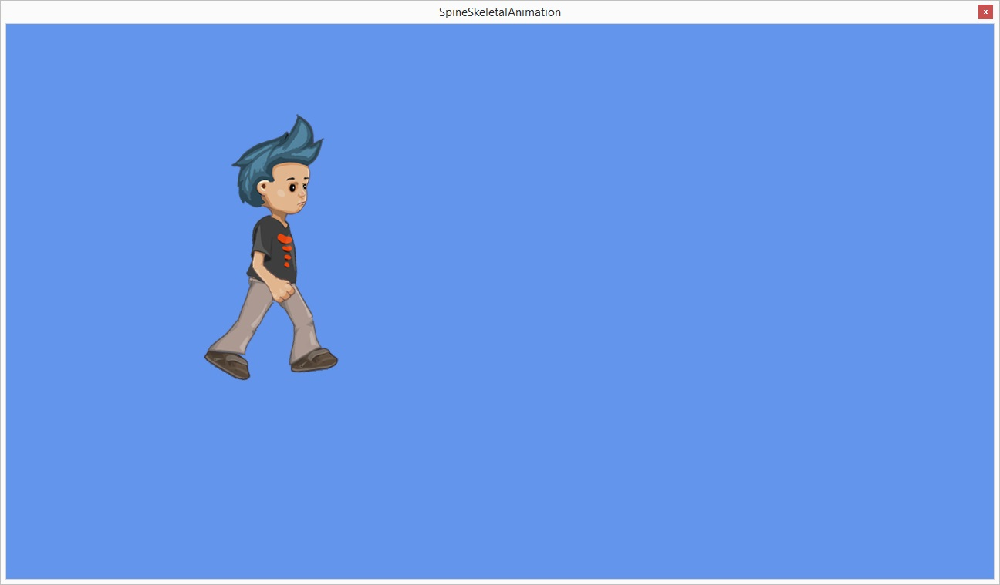

## Goal

Within this recipe we will learn how to consume an animation made with Spine. From the assets used to the animations them-selves we will integrate those within Wave Engine.

## Hands-on

Spine is a great tool to create animations by deforming texture vertices on a time line. You can get more information on how to work with Spine [here](http://es.esotericsoftware.com/spine-in-depth).


_Spine screenshot. Image taken from Java-Gaming.org [forum](http://www.java-gaming.org/topics/spine-2d-skeletal-animation/27914/view.html)_

In order to use its outputs with Wave Engine, you must export the project as JSON format. Once we have the JSON file, we must add it to the Wave Project from Wave Visual Editor, along with the .atlas folder containing the whole assets set used with Spine.

> [!Note]
>  Within this recipe we are taking the assets from [this sample](https://github.com/WaveEngine/Samples/tree/master/Extensions/SpineSkeletalAnimation), more exactly from [here](https://github.com/WaveEngine/Samples/tree/master/Extensions/SpineSkeletalAnimation/Content/Assets).

### Using Wave Visual Editor and Visual Studio/Xamarin Studio

Open or create a WaveEngine project in Wave Visual Editor and import the exported Spine assets:



Wave Engine contains some components which make really easy to include Spine animations, which are:
 * **SkeletalData** pointing to the atlas asset.
 * **SkeletalAnimation** handling the whole animations set (the JSON file actually).
 * **SkeletalRenderer** in charge of drawing the animation assets following the deformations specified at the JSON file.

Create a new Entity and insert it a Transform2D and all three Skeletal components: SkeletalData, SkeletalAnimation and SkeletalRenderer:



Select the new entity and set the Skeletal properties to use the desired Spine model:





### Using Visual Studio/Xamarin Studio

Open or create a WaveEngine project in Wave Visual Editor and import the exported Spine assets (see past chapter: "Using Wave Visual Editor and Visual Studio/Xamarin Studio" from this recipe):

**First we need to add the nuGet WaveEngine.Spine reference.**

Building an entity:
 
```c#
var character = new Entity()
	.AddComponent(new Transform2D())
	.AddComponent(new SkeletalData(WaveContent.Assets.spineboy_atlas))
	.AddComponent(new SkeletalAnimation(WaveContent.Assets.spineboy_json))
	.AddComponent(new SkeletalRenderer());
```

In the same way Animation2D works for sprite sheets, we can use here `SkeletalAnimation` with exactly the same API:

```c#
var anim = character.FindComponent<SkeletalAnimation>();
	anim.CurrentAnimation = "walk";
	anim.Play(true);
```

## Wrap-up

We have learned how to generate the animation from Spine so it can be consumed with Wave Engine, to create an entity which builds it up and to play its animation.