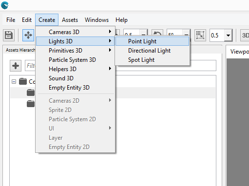
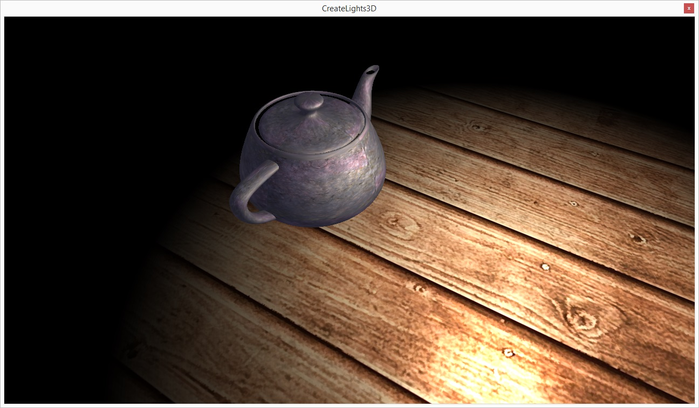
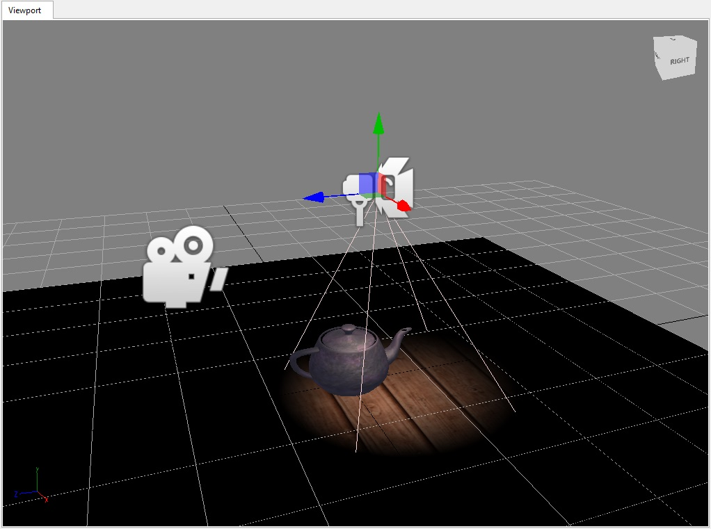
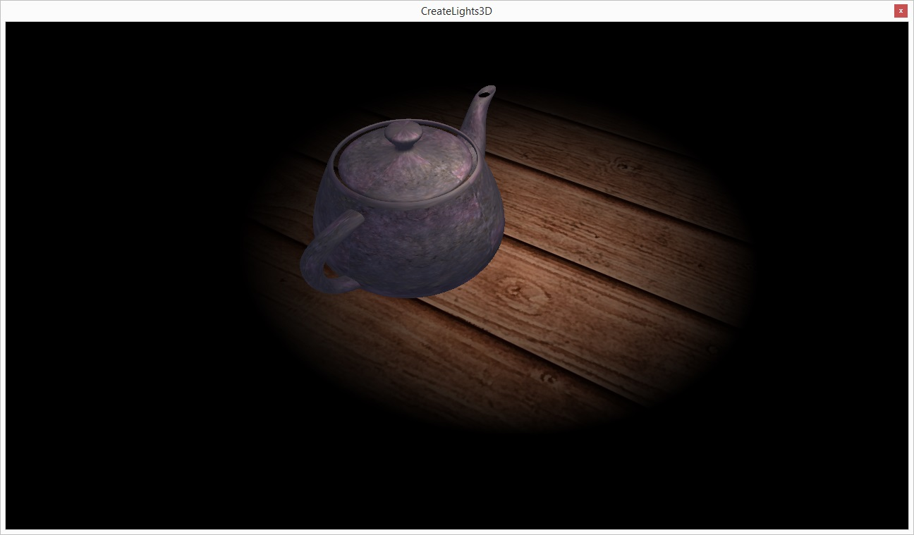

## Goal

Lights, in 3D engines, help make more realistic the visual representation. Also, those make us easier to understand whether a mesh is closer or not to the camera. Wave Engine supports currently three types of light: directional, point and spot. In just a few steps your game will look even better adding those to your scenes.

NOTE: Lights currently do not support dropping shadows, but it is a work in process, and we have internally demos with such working.

## Hands-on

Lights can be found under [WaveEngine.Framework.Graphics](xref:WaveEngine.Framework.Graphics) namespace. The built-in 3D ones are:
  * [DirectionalLight](xref:WaveEngine.Framework.Graphics.DirectionalLight): it creates a vector-driven infinite light.
  * [PointLight](xref:WaveEngine.Framework.Graphics.PointLight): it enables an spherical one.
  * [SpotLight](xref:WaveEngine.Framework.Graphics.SpotLight): finally, a finite conical light. 

### With Wave Visual Editor

Once you have a project opened, you can see the "Lights 3D" under Create menu item.



Selecting each one of those, it will be automatically added to the current scene, and the Viewport will reflect how the light acts in pure real time (you can also run the project):

* Directional Light (Sun-like effect):


* Point Light (spherical):




* Spot Light (focused):





### With Visual Studio/Xamarin Studio

Knowing how each light react visually, those can be added with just two lines of code:

* [DirectionalLight](xref:WaveEngine.Framework.Graphics.DirectionalLight):
```c#
var light = new DirectionalLight("directionalLight", new Vector3(1, 0, 0));
this.EntityManager.Add(light);
```

* [PointLight](xref:WaveEngine.Framework.Graphics.PointLight):
```c#
var light = new PointLight("pointLight", new Vector3(0, 1, 0));
this.EntityManager.Add(light);
```

* [SpotLight](xref:WaveEngine.Framework.Graphics.SpotLight):
```c#
var light = new SpotLight("spotLight", new Vector3(0, 1, 0));
this.EntityManager.Add(light);
```

## Wrap-up

We have gone through the available 3D lights bundled in Wave Engine: directional, spot and point; and how those are added to our game, empowering its visuals with an small cost.