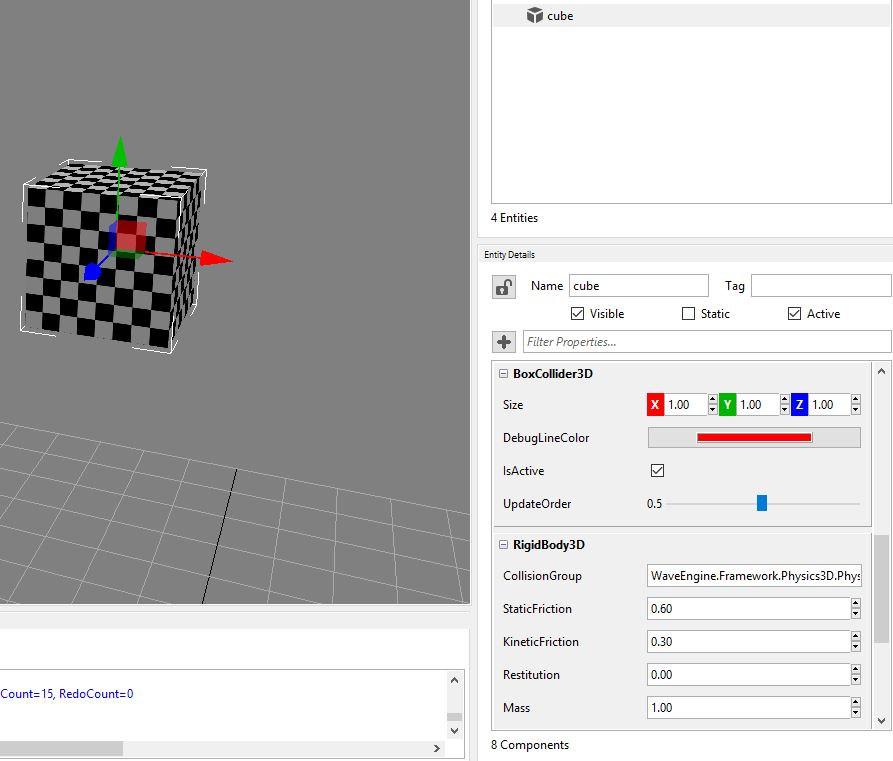

## Goal

Nowadays, adding physic behaviour to our game is as immediate as adding a few lines of code. Wave Engine wraps low level physic components leveraging a simple API which follows the guidelines found all over the engine: component-based architecture, specific renderer for each drawable component, etc.

On the following paragraphs, we will learn how to add a rigid body physic capability to an entity, acting according to the world gravity.

## Hands-on

Converting an entity into a physic object is particularly easy with Wave Engine. There are multiple forms of physic objects available, but here we will cover the most basic one: [RigidBody3D](xref:WaveEngine.Framework.Physics3D.RigidBody3D). It can be found under [WaveEngine.Framework.Physics3D](xref:WaveEngine.Framework.Physics3D) namespace, where the rest of physic 3D capabilities are collected.

Wave Engine's 3D physics are based on [BEPU Physics Engine](https://bepuphysics.codeplex.com/), whose physic properties are bypassed to the first with the same meaning:
 * [Damping](xref:WaveEngine.Physics.PhysicsBody3D.Damping): _is used to reduce the world velocity of bodies. Damping is different than friction because friction only occurs with contact. Damping is not a replacement for friction and the two effects should be used together. Damping parameters should be between 0 and infinity, with 0 meaning no damping, and infinity meaning full damping_
 * [StaticFriction](xref:WaveEngine.Physics.PhysicsBody3D.StaticFriction) & [KineticFriction](xref:WaveEngine.Physics.PhysicsBody3D.KineticFriction): _are used to make objects slide along each other realistically. The first one is used when the object is sliding slowly, and the second is used when the object is sliding quickly. [...] The friction parameter is usually set between 0 and 1, but can be any non-negative value. A friction value of 0 turns off friction and a value of 1 makes the friction strong_
 * [Restitution](xref:WaveEngine.Physics.PhysicsBody3D.Restitution): _is used to make objects bounce. The restitution value is usually set to be between 0 and 1. Consider dropping a ball on a table. A value of zero means the ball won't bounce. This is called an inelastic collision. A value of one means the ball's velocity will be exactly reflected. This is called a perfectly elastic collision_
 * [Rotation](xref:WaveEngine.Physics.PhysicsBody3DRotation): _expressed in radians, allow the entity to rotate during the physics computation happens_

### With Wave Visual Editor

Once you have a project opened, simply generate a new entity from top menu option Create, Primitives 3D and Cube; and add it a `RigidBody3D` component, modifying its properties to your liking:


 
### With Visual Studio/Xamarin Studio

Within the Shared Project, create a new `Entity` containing a cube:

```c#
var cube = new Entity("cube")
     .AddComponent(new Transform3D())
     .AddComponent(Model.CreateCube())
     .AddComponent(new ModelRenderer())
     .AddComponent(new MaterialsMap())
     .AddComponent(new BoxCollider3D())
     .AddComponent(new RigidBody3D());
this.EntityManager.Add(cube);
```

The resulting execution will show a cube, which immediately falls down being accelerated by the gravity.

## Wrap-up

We have learned where the 3D physic API is located inside Wave Engine. We have also introduced the `RigidBody3D` component, and some of the most used properties. Finally, we have created an `Entity` with this which behaves like a physic object.