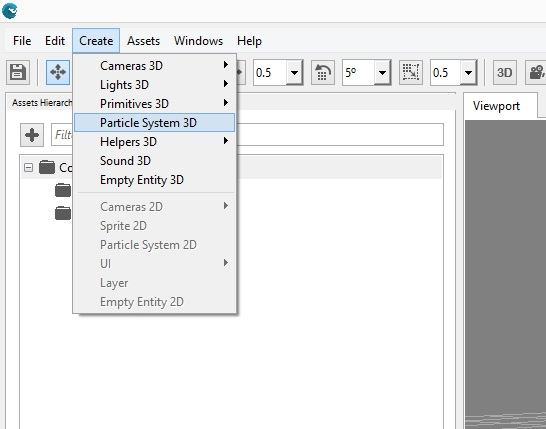

## Goal

Have you ever seen an explosion in a video-game? Such is surely done with particles. Those allow us to give dynamism to a game by creating good-looking effects.

Whitin this recipe you will learn how to create a 3D particles system in your game, both from Wave Visual Editor or your favorite IDE; and how to customize its looking to fit your effect needs.

## Hands-on

### With Wave Visual Editor

Once you have a project opened in Wave Visual Editor, under Create menu item choose Particle System 3D:



At the right side, within Entity Details, you will find a set of properties which will define the way our particles will work:
* [AlphaEnabled](xref:WaveEngine.Components.Particles.ParticleSystem3D.AlphaEnabled): whether allow transparency in particles or not.
* [Bounciness](xref:WaveEngine.Components.Particles.ParticleSystem3D.Bounciness): when [CollisionBehavior](xref:WaveEngine.Components.Particles.ParticleSystem3D.CollisionBehavior) is set to bounce, it defines particles' amount of bounciness.
* [CollisionBehavior](xref:WaveEngine.Components.Particles.ParticleSystem3D.CollisionBehavior): what happens on collision: bounce or die.
* [CollisionMin](xref:WaveEngine.Components.Particles.ParticleSystem3D.CollisionMin)/[CollisionMax](xref:WaveEngine.Components.Particles.ParticleSystem3D.CollisionMax): ends which define a bounding box to detect collisions between particles.
* [CollisionSpread](xref:WaveEngine.Components.Particles.ParticleSystem3D.CollisionSpread): direction a particle will take after colliding.
* [CollisionType](xref:WaveEngine.Components.Particles.ParticleSystem3D.CollisionType): limits bounding box defined in [CollisionMin](xref:WaveEngine.Components.Particles.ParticleSystem3D.CollisionMin)/[CollisionMax](xref:WaveEngine.Components.Particles.ParticleSystem3D.CollisionMax) will have: none, min. X, max. X, min. Y, max. Y, min. Z or max. Z.
* [Emit](xref:WaveEngine.Components.Particles.ParticleSystem3D.Emit): whether to actually emit particles or not.
* [EmitRate](xref:WaveEngine.Components.Particles.ParticleSystem3D.EmitRate): particles emitted per second.
* [EmmiterShape](xref:WaveEngine.Components.Particles.ParticleSystem3D.EmitterShape): the shape the emiter will have: rectangle (its edges), filled rectangle, circle (its perimeter) or filled circle.
* [EndDeltaScale](xref:WaveEngine.Components.Particles.ParticleSystem3D.EndDeltaScale): scale the particle will have just before dying.
* [Gravity](xref:WaveEngine.Components.Particles.ParticleSystem3D.Gravity): direction and strength of the gravity effect.
* [InitialAngle](xref:WaveEngine.Components.Particles.ParticleSystem3D.InitialAngle): the one each particle will begin with.
* [LinearColorEnabled](xref:WaveEngine.Components.Particles.ParticleSystem3D.LinearColorEnabled): whether it is allowed particles to change their color.
* [LocalVelocity](xref:WaveEngine.Components.Particles.ParticleSystem3D.LocalVelocity): space the particles will move in X, Y and Z axes.
* [MinColor](xref:WaveEngine.Components.Particles.ParticleSystem3D.MinColor)/[MaxColor](xref:WaveEngine.Components.Particles.ParticleSystem3D.MaxColor): color range particles can go through.
* [MinLife](xref:WaveEngine.Components.Particles.ParticleSystem3D.MinLife)/[MaxLife](xref:WaveEngine.Components.Particles.ParticleSystem3D.MaxLife): minimum and maximum, respectivelly, live time on each particle.
* [MinRotateSpeed](xref:WaveEngine.Components.Particles.ParticleSystem3D.MinRotateSpeed)/[MaxRotateSpeed](xref:WaveEngine.Components.Particles.ParticleSystem3D.MaxRotateSpeed): minimum and maximum, respectivelly, rotation speeds for each particle.
* [MinSize](xref:WaveEngine.Components.Particles.ParticleSystem3D.MinSize)/[MaxSize](xref:WaveEngine.Components.Particles.ParticleSystem3D.MaxSize): minimum and maximum, respectivelly, size each particle can have.
* [NumParticles](xref:WaveEngine.Components.Particles.ParticleSystem3D.NumParticles): maximum amount of particles generated at same time.
* [RandomVelocity](xref:WaveEngine.Components.Particles.ParticleSystem3D.RandomVelocity): velocity spent randomly on particles (independent between those).

For instance, here we have tried to mimic the snow falling from a cloudy and dark sky:


### With Visual Studio/Xamarin Studio

Add the following lines to your `Scene` class -where you can find above the description for all of [ParticleSystem3D](xref:WaveEngine.Components.Particles.ParticleSystem3D) properties:

```c#
 var particles = new Entity("Particles")
    .AddComponent(new Transform3D())
    .AddComponent(new ParticleSystem3D()
        {
            Emit = true,
            NumParticles = 200,
            EmitterShape = ParticleSystem3D.Shape.FillRectangle,
            EmitterSize = new Vector2(10.0f, 10.0f),
            EmitRate = 100.0f,
            LocalVelocity = new Vector3(0.0f, -0.04f, 0.0f),
            RandomVelocity = new Vector3(0.01f, 0.05f, 0.01f),
            Gravity = Vector3.Zero,
            InitialAngle = 0.0f,
            MinRotateSpeed = 0.0f,
            MaxRotateSpeed = 10.0f,
            MinSize = 0.05f,
            MaxSize = 0.2f,
            EndDeltaScale = 0.0f,
            MinLife = 1.0f,
            MaxLife = 2.0f,
            LinearColorEnabled = false,
            AlphaEnabled = true,
            CollisionType = ParticleSystem3D.ParticleCollisionFlags.None
        })
    .AddComponent(new ParticleSystemRenderer3D())
    .AddComponent(new MaterialsMap());
this.EntityManager.Add(particles);
```

## Wrap-up

We have learned how to add a 3D particles system, and which are the most relevant properties to customize it.