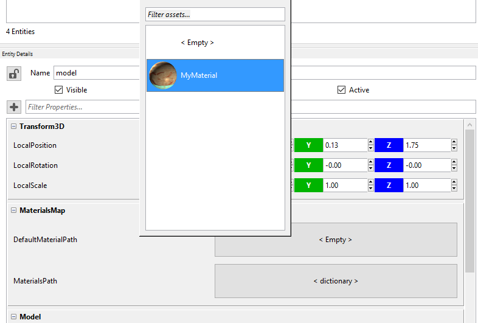

## Goal

Have you ever wondered how to add a material to an existing model? A material comprises the details of what an object should look like (for example: its color and whether it is dull or shiny). However, a texture is just an image which is dumped into the model's mesh.

Wave Engine allows textures to influence materials in various ways, such as altering their colors. Multiple textures can interact with each other to produce interesting effects.

Note that textures have to be attached to materials to affect models, you cannot apply a texture to a model without a material.

## Hands-on

### With Wave Visual Editor

On the Asset Details panel, double click on Assets folder:


Right click on the pane and select Create Material option. Material Editor window will be opened to specify material properties. You can modify these properties as you need and see the changes in the left preview detail.


Once Wave Visual Editor has loaded the new material, simply drag the item from the Asset Details panel and drop it in the Viewport, just on top of the existing model.


Also, you can achieve the same through [DefaultMaterialPath](xref:WaveEngine.Components.Graphics3D.MaterialsMap.MaterialsPath) property, from entity's [MaterialsMap](xref:WaveEngine.Components.Graphics3D.MaterialsMap) component:



### With Visual Studio/Xamarin Studio

From Wave Visual Editor, click on File > Open C# Solution...; and rebuild it just to update `WaveContent.cs`. It will contain the paths to the assets you have previously added in the Editor.

Modify [CreateScene()](xref:WaveEngine.Framework.Scene.CreateScene) method from your scene to instantiate a new [StandardMaterial](xref:WaveEngine.Materials.StandardMaterial):

```C#
protected override void CreateScene()
{
    this.Load(WaveContent.Scenes.MyScene);

    var material = new StandardMaterial()
    {
         SpecularPower = 116.4f,
         DiffuseColor = Color.AntiqueWhite,
         EmissiveColor = Color.MediumTurquoise,
         DiffusePath = WaveContent.Assets.Textures.column1_png,
         NormalPath = WaveContent.Assets.Textures.column1_normal_png,
         SpecularPath = WaveContent.Assets.Textures.column1_spec_png,
         EmissivePath = WaveContent.Assets.Textures.column1_emissive_png
    };
}
```

You can add this material now to any model setting the [MaterialsMap.DefaultMaterial](xref:WaveEngine.Components.Graphics3D.MaterialsMap.DefaultMaterial) property:

```C#
var model = new Entity()
    .AddComponent(new Transform3D())
    .AddComponent(new MaterialsMap()
    {
        DefaultMaterial = material
    })
    .AddComponent(new Model(WaveContent.Assets.Models.column1_fbx))
    .AddComponent(new ModelRenderer());

this.EntityManager.Add(model);
```

Even further, a material created visually from the Editor can be set through [DefaultMaterialPath](xref:WaveEngine.Components.Graphics3D.MaterialsMap.DefaultMaterialPath) property:

```C#
var model = new Entity()
    .AddComponent(new Transform3D())
    .AddComponent(new MaterialsMap()
    {
        // Notice here the difference regarding previous snippet
        DefaultMaterialPath = WaveContent.Assets.MyMaterial
    })
    .AddComponent(new Model(WaveContent.Assets.Models.column1_fbx))
    .AddComponent(new ModelRenderer());

this.EntityManager.Add(model);
```

## Wrap-up

You have learned the difference between textures and materials, and how to add those both visually and through source code.