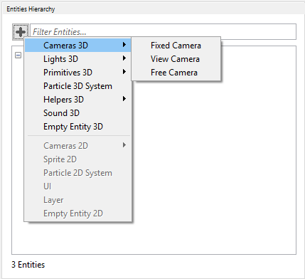
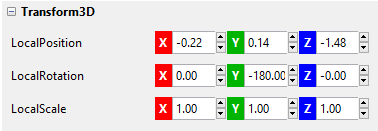
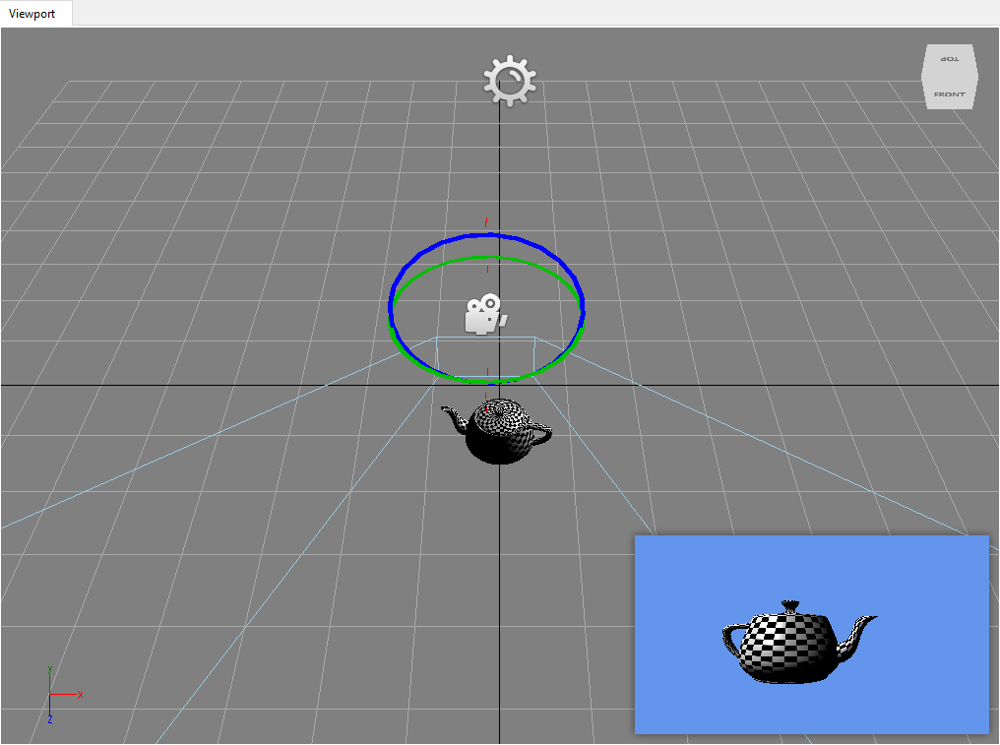

## Goal

At least one camera is a must-have on any Wave Engine project. When a game is run, the screen rendered is the result of what such camera is seeing of the world.

Within this recipe you will learn how to add a 3D camera to your game both from Wave Visual Editor or your favorite IDE.

## Hands-on

Cameras can be found under `WaveEngine.Components.Cameras` namespace. The built-in 3D cameras in Wave Engine are:
  * [FixedCamera3D](xref:WaveEngine.Components.Cameras.FixedCamera3D): This camera does not have any built-in behavior, it is static.
  * [FreeCamera3D](xref:WaveEngine.Components.Cameras.FreeCamera3D): This camera can be moved using the mouse, touch or keyboard.
  * [ViewCamera3D](xref:WaveEngine.Components.Cameras.ViewCamera3D): This camera can be moved using the mouse, touch or keyboard while respecting the look-at point. 

### With Wave Visual Editor

Once you have a project in Wave Visual Editor, you can see the "Add Entity" button in the "Entities Hierarchy" panel at the right side of the screen:



Clicking on an kind of 3d camera it is added to the scene.

Now, in the "Entity Details" panel, you can modify the desired properties of the entity:




The result can be viewed in the "Viewport" view when the camera is selected:



### With Visual Studio/Xamarin Studio

In Wave Visual Editor go to File, Open C# Solution... Within the Shared Project, open an existing [Scene](xref:WaveEngine.Framework.Scene) class. Usually, the camera is added at the beginning of the `Scene.CreateScene()` method. For example, the following snippet creates a `FreeCamera3D` and adds it to the `EntityManager`. An important key is the `BackgroundColor` property, which allows to choose which `Color` is used to clear the screen on each draw call.

```c#
// Where the camera is placed on the world
var position = new Vector3(0, 0, 2.5f);
// Where the camera is looking at
var lookAt = Vector3.Zero;
var camera = new FreeCamera3D("MainCamera", position, lookAt)
{
    BackgroundColor = Color.CornflowerBlue
};
this.EntityManager.Add(camera.Entity);
```

> [!Note] 
> The reason why it is added `camera.Entity` to the `EntityManager` is `ViewCamera` inherits from [BaseDecorator](xref:WaveEngine.Framework.BaseDecorator), a built-in mechanism to create and wrap new `Entity`'s on demand.

Appart from position and look-at, there are some other properties which let customize more in depth the cameras behaviour: field of view, aspect ratio, etc. -some of these are covered [here](http://www.slideshare.net/waveengineteam/waveengine-3d-components) (slides 25-26). The whole source code is available [here](https://github.com/WaveEngine/Components/tree/master/Cameras).

## Wrap-up

This recipe has listed which cameras can be found within Wave Engine, and how can be easily added to a project.