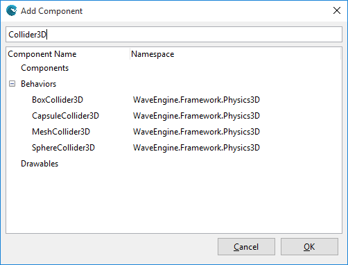

## Goal

To know when two different 3D entities collide between them, Wave Engine offers collision components. Colliders, as they are named, are available also in 2D (within Wave Engine are used, for instance, for the tap behavior on UI controls).

However, we will concentrate here on how to add such functionality within 3D.

## Hands-on

[Collider3D](xref:WaveEngine.Framework.Physics3D.Collider3D) is the base abstract class for the following built-in colliders:
* [BoxCollider3D](xref:WaveEngine.Framework.Physics3D.BoxCollider3D)
* [CapsuleCollider3D](xref:WaveEngine.Framework.Physics3D.CapsuleCollider3D)
* [MeshCollider3D](xref:WaveEngine.Framework.Physics3D.MeshCollider3D)
* [SphereCollider3D](xref:WaveEngine.Framework.Physics3D.SphereCollider3D)

Every `Collider3D` requires the following components in the entity:
* a [Model](xref:WaveEngine.Components.Graphics3D.Model), which contains the mesh for the 3D object; and
* a [Transform3D](xref:WaveEngine.Framework.Graphics.Transform3D), which handles the position in the 3D world, among other things

### With Wave Visual Editor

Simply add the [BoxCollider3D](xref:WaveEngine.Framework.Physics3D.BoxCollider3D) behavior using the Add Component button in the Entity Details panel:



### With Visual Studio/Xamarin Studio

The entity would be built in the following way:

```c#
var cube = new Entity("Cube") 
    .AddComponent(new Transform3D()) 
    .AddComponent(new BoxCollider3D()) 
    .AddComponent(Model.CreateCube()) 
    .AddComponent(new MaterialsMap( [...] ))
    .AddComponent(new ModelRenderer());
```

Later on, in order to check for intersections, we would simply call each specific `Collider3D.Intersects()` method.

## Wrap-up

This recipe shows how a `Collider3D` component can be easily added to entities, in order to detect collisions between them.