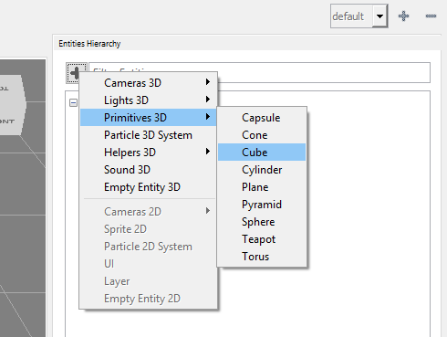
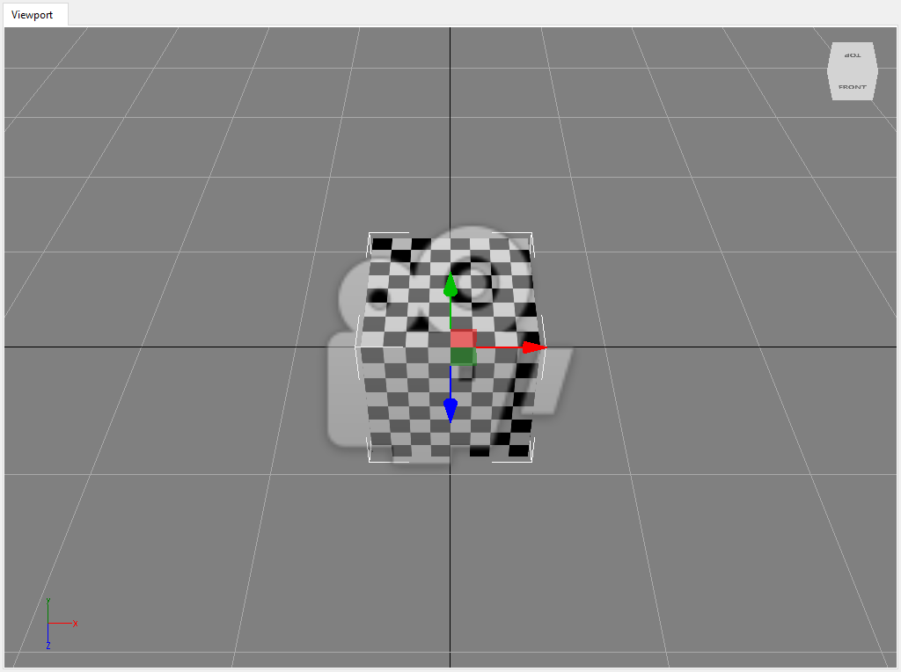

## Goal

You will be guided through the steps needed to add a 3D primitive to an scene. Such primitives are basic meshes -plane, cube, sphere, etc.- whose configurations are built-in, and are often present on 3D modelling software such like 3D Studio or Blender.

## Hands-on

### With Wave Visual Editor

At Entities Hierarchy panel, right at the top right corner, you will find a "+" icon. Doing click on it, a context menu will display all the available predefined entities, whose contain Primitives 3D.



Just click on one of those, and the primitive will appear at the Viewport.



### With Visual Studio/Xamarin Studio

Every 3D primitive which can be added visually following above instructions, is available as well in source code. [Model](xref:WaveEngine.Components.Graphics3D.Model) factory makes it really simple to add a cube, for instance. Within the dessired `Scene`, inside `CreateScene()` method, add the following lines:

```c#
var primitive = new Entity()
	.AddComponent(Model.CreateCube())
	.AddComponent(new ModelRenderer())
	.AddComponent(new MaterialsMap())
	.AddComponent(new Transform3D());
this.EntityManager.Add(primitive);
```


You can see the whole list of available primitives [here](xref:WaveEngine.Components.Graphics3D.Model#methods), all those following the `Create`* pattern.

## Wrap-up

You have learned what is a basic primitive, and how to add those both visually and through source code. `Model` class will help you providing helper methods which directly return the dessired primitives.