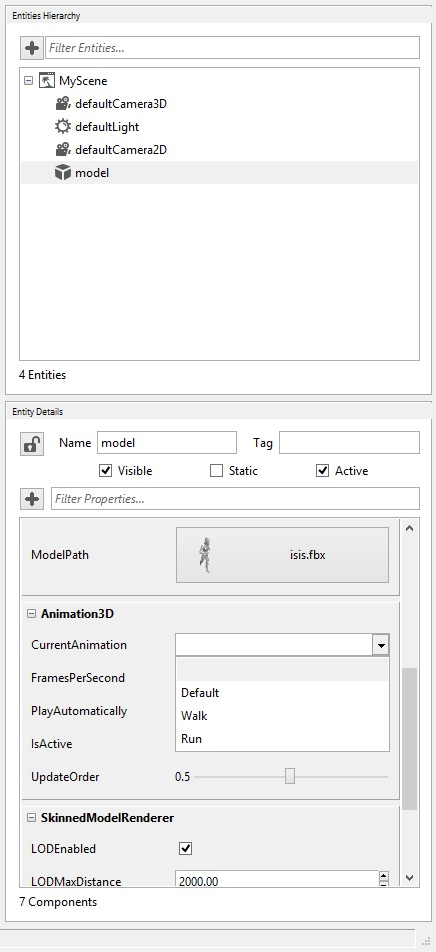

## Goal

*Please, it is a prerequisite to go through [Load FBX Model](Load-an-FBX-Model.md) first.*

As we have already learned, loading an FBX model into Wave Engine is incredible easy. What we have not covered already, is how to reproduce the animations bundled into the FBX. Isis model used in [[Load an FBX Model]], which will be reused here, contains different animations, and we will learn how to configure those for playing on demand.

## Hands-on

### With Wave Visual Editor

Please, follow the steps within "With Wave Visual Editor" section at [Load FBX Model](Load-an-FBX-Model.md). Once Isis in on screen, go back to the Asset Details panel and double click on "isis" model. Asset Viewer will then open.


Isis model has animations included, you can see them in action by clicking the play button:


Such will reproduce every animation within a single timeline, as those are present on the FBX file. We still do not have different animations splitted, which is what we will continue with.

At Animations area, create through '+' button different rows named "Default", "Walk" and "Run"; resulting in (notice each Start and End keyframe):


You can reproduce each animation individually by selecting its row and clicking on play button.

Once you have finished, click OK.

Have a look to the Entities Hierarchy panel and select the "model" one. Notice how Entity Details panel is updated with its components, and scroll down until you see [Animation3D](xref:WaveEngine.Components.Animation.Animation3D) one. Open the [CurrentAnimation](xref:WaveEngine.Components.Animation.Animation3D#WaveEngine_Components_Animation_Animation3D_CurrentAnimation) combo box and choose "Run"; check also [PlayAutomatically](xref:WaveEngine.Components.Animation.AnimationBase##WaveEngine_Components_Animation_AnimationBase_PlayAutomatically).



Finally, run the project and you will see Isis running, as it was expected.

### With Visual Studio/Xamarin Studio

In the same way as above, please, follow the steps within "With Visual Studio/Xamarin Studio" section at [Load FBX Model](Load-an-FBX-Model.md). Starting from such existing code, we will just call [Animation3D](xref:WaveEngine.Components.Animation.Animation3D)'s [PlayAnimation()](xref:WaveEngine.Components.Animation.Animation3D.PlayAnimation(System.String,System.Nullable{System.Int32},System.Nullable{System.Int32},System.Boolean,System.Boolean)) method to enable automatic playback:

```C#
// Uncomment below line if Isis model was added visually
//var isis = this.EntityManager.Find("model");
var animation3DComponent = isis.FindComponent<Animation3D>();
animation3DComponent.PlayAnimation("Run");
```

> [!Note]
> Animation keys used from source code (i.e. "Run") are the ones defined above with Wave Visual Editor.

## Wrap-up

We have learned how to reproduce the different animations an FBX model bundles.