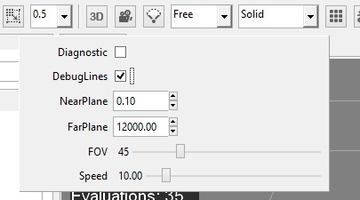

## Goal

Within this recipe you will learn how to enable debug lines to see every debuggable lines that an entity has and that can be shown in real time.

## Hands-on

### With Wave Visual Editor

On the editor you can enable this mode by checking the *Diagnostic* button on the camera option panel:



### With Visual Studio/Xamarin Studio

You just need create an empty new project in **Visual Wave Editor**, and switch to **Visual Studio** or **Xamarin Studio** by clicking on File > Open C# Solution...

To activate the DebugLines mode you need to add this line of code:

```C#
RenderManager.DebugLines = true;
```

## Wrap-up

You have learned how to enable debug lines to see every debuggable lines that an entity owns and that can be shown in real time.
