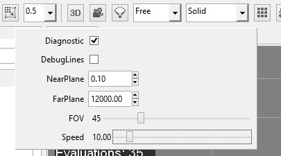

## Goal

Within this recipe you will learn how to enable the diagnostic mode in your games when you need to measure things while you are developing.

## Hands-on

### With Wave Visual Editor

On the editor you can enable this mode by checking the button *Diagnostic* on the camera options:



### With Visual Studio/Xamarin Studio

You just need create an empty new project in **Visual Wave Editor**, and switch to **Visual Studio** or **Xamarin Studio** by clicking on *File > Open C# Solution...*

To activate the diagnostic mode you need to add this line of code:

```C#
WaveServices.ScreenContextManager.SetDiagnosticsActive(true);
```

And add the *PROFILE* conditional compilation symbol to your project.

By doing this, a FPS counter will appear in the upper left corner on the screen.
But **Wave Engine** offers some simple tools to track the information we need. You can add labels for literal content or timers to measure things with the code:

```C#
Labels.Add("Life", life.ToString());

Timers.BeginTimer("Load started");
// ToDo something
Timers.EndTimer("Load finished");
```

## Wrap-up

With this very simple tools you can visualize the information you need to see how your game is running.