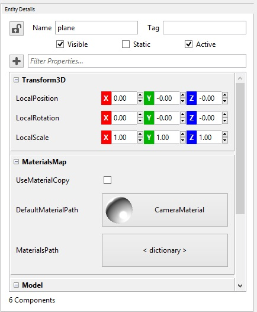

## Goal

Within this recipe you will learn how to capture images from a webcam and use it as a texture for an entity of your games.

## Hands-on

### With Wave Visual Editor

On an empty project, add a plane to the scene:


In *Asset Details* panel, create a Standard Material with default values and name it *CameraMaterial*

In *Entities Hierarchy* panel, select the *plane* entity that you have previously added, and assign the *CameraMaterial* in the "DefaultMaterialPath" property from **MaterialsMap**



Now, open the solution with Visual Studio or Xamarin Studio with the *File > Open C# Solution ...* menu, and continue reading the next section.


### With Visual Studio/Xamarin Studio

You need to copy the content from [here](https://github.com/WaveEngine/Samples/tree/master/Media/CameraCapture/Libraries) and create the same folder side by side to your solution file.
Add this post-build event to launcher project:

`copy /Y "$(SolutionDir)Libraries\libvlc.dll"  "$(TargetDir)"`

`copy /Y "$(SolutionDir)Libraries\libvlccore.dll"  "$(TargetDir)"`

`mkdir "$(TargetDir)\plugins"`

`xcopy  "$(SolutionDir)Libraries\plugins" "$(TargetDir)plugins" /e /i /h /y /q`

You need to start the built-in **Wave Service Camera Capture** to initialize the web cam to be able to use it in your game. To do this, add this line in *CreateScene* method from *MyScene* class:

```C# 
WaveServices.CameraCapture.Start(CameraCaptureType.Front);
```

Last thing you need to do is to modify the standard material you created with Wave Visual Editor, and set the *Diffuse* texture with the camera output. To do this add these lines after the initialization of the camera service:

```C#

StandardMaterial cameraMaterial = this.Assets.LoadModel<MaterialModel>(WaveContent.Assets.CameraMaterial).Material as StandardMaterial;

cameraMaterial.Diffuse = WaveServices.CameraCapture.PreviewTexture;
```

If you build and run your project, you will see a plane with what the camera is seeing.
## Wrap-up

You have learned how to capture a web cam input and use it as a texture in your games.