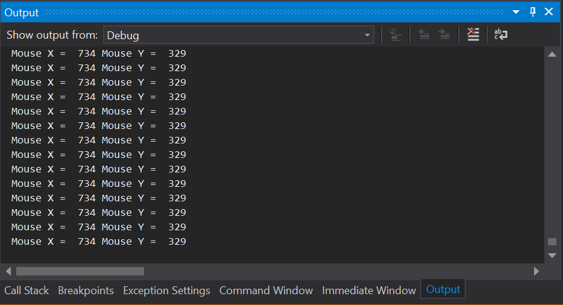
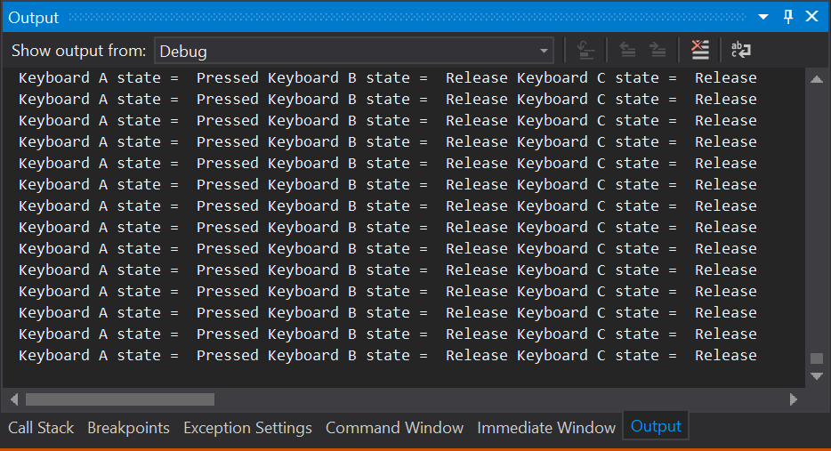
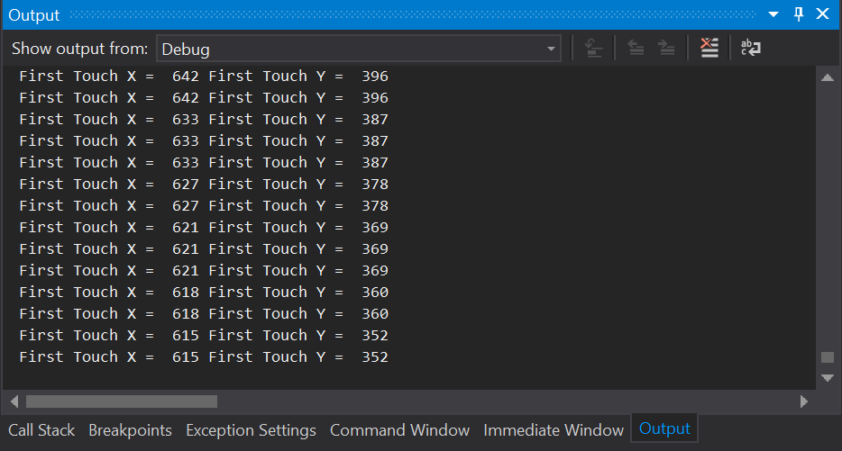

## Goal 
 
Within this recipe you will learn how to detect keyboard, mouse and touch inputs using the WaveEngine `Input` service.
These are basic interaction devices for any game you create, particularly the touch manager.
 
## Hands-on 
 
### With Visual Studio/Xamarin Studio 
 
It's time to coding, open a WaveEngine C# solution and add a new SceneBehavior.

```c#

protected override void CreateScene()
{
	this.Load(WaveContent.Scenes.MyScene);       
	
	this.AddSceneBehavior(new MySceneBehavior(), SceneBehavior.Order.PostUpdate);    
}

```

In the SceneBehavior Update method add the following code snippets.


```c#

var mouseState = WaveServices.Input.MouseState;
if (mouseState.IsConnected)
{
	var x = mouseState.X;
	var y = mouseState.Y;
	
	Trace.WriteLine(string.Format("Mouse X = {0,4} Mouse Y = {1,4}", x, y));
}
	
```

First of all, We'll inspect the output in Visual Studio/Xamarin Studio.



As you see, `WaveServices.Input.MouseState` provides you a structure on every game Update with the state of the Mouse with its position.

Let's move to the keyboard, here you have a similar piece of code that outputs the state of three buttons of the keyboard.

```c#

var keyboardState = WaveServices.Input.KeyboardState;
if (keyboardState.IsConnected)
{
	var a = keyboardState.A;
	var b = keyboardState.B;
	var c = keyboardState.C;

	Trace.WriteLine(string.Format("Keyboard A state = {0,8} Keyboard B state = {1,8} Keyboard C state = {2,8}", a, b, c));
}

```




Here we got a similar output as the previous one but with the state of the A, B and C keys.


TouchPanelState is one of the most useful struct the input service provides, you must check the structure to get every touch point detected by the phone.
Beware that mouse clicks are mapped as touchs in case you use TouchPanelState in desktop games.

```c#

var touchPanelState = WaveServices.Input.TouchPanelState;
if (touchPanelState.IsConnected)
{
	if (touchPanelState.Count > 0)
	{
		var firstTouch = touchPanelState.First();
		var currentPosition = firstTouch.Position;

		Trace.WriteLine(string.Format("First Touch X = {0,4} First Touch Y = {1,4}", currentPosition.X, currentPosition.Y));
	}
}

```




Don't forget that WaveEngine also provides other input sources for your game, as the AccelerometerState, CompassState, GyroscopeState and more.


## Wrap-up

We have seen how the `Input` service could be used to retrieve the state of the mouse, keyboard and mobile touchPanel.